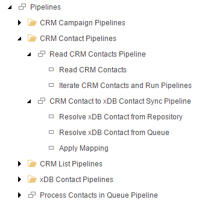

Pipeline Step
=======================================

A pipeline is a collection of *pipeline steps*.  The pipeline is 
significant because it determines which steps are run, and the order
in which they are run. But what actually happens when a pipeline is
run is configured using the pipeline steps that make up the pipeline.

For example, consider a pipeline that represents the ability to load 
contacts from a CRM into Sitecore. This process might be implemented 
in several pipeline steps:

    1. Read contacts from CRM
    2. Loop through the CRM contacts
    3. Create or update the corresponding Sitecore contacts

In Data Exchange Framework, a pipeline step is represented by 
a Sitecore item. The following image shows the pipeline steps 
that make up the synchronization processes that involve CRM 
contacts for the Dynamics CRM Provider for Data Exchange 
Framework:

.. hint::

    One of the main tasks involved with building a custom provider
    for Data Exchange Framework is designing and implementing 
    custom pipeline steps. These are the parts of a synchronization
    process that are unique to the system you are integrating.

.. hint:: 

    While it is possible to implement all of the logic for a pipeline  
    in a single pipeline step, this is not advised.
    
    Limiting each pipeline step to representing a distinct task will 
    result in components that are much easier to configure, maintain, 
    support, troubleshoot and reuse.  
    