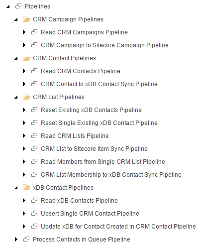

Pipeline
=======================================

A *pipeline* represents a unit of work that is modeled using Data
Exchange Framework. Virtually anything can be modeled in a pipeline,
but usually a pipeline models some sort of data transfer or data 
synchronization process.

Examples of pipelines are:

    * Load contacts from a CRM into Sitecore
    * Update product information in Sitecore from a PIM
    * Remove expired accounts from a CRM

In Data Exchange Framework, a pipeline is represented by a Sitecore 
item. The following image shows the pipelines that make up the 
synchronization processes for the Dynamics CRM Provider for Data 
Exchange Framework:

.. hint:: 

    If you are familiar with Sitecore, you are probably already
    familiar with the concept of a pipeline. In Sitecore, a 
    pipeline is also used to model a unit of work. Conceptually,
    pipelines in Sitecore and pipelines in Data Exchange Framework
    serve the same purpose.

    The main difference between the pipelines Sitecore pipelines 
    and Data Exchange Framework is that Sitecore pipelines are 
    tightly coupled with Sitecore. Sitecore pipelines can only run
    within Sitecore.
    
    Data Exchange Framework pipelines are configured in Sitecore, 
    but they do not have to run within Sitecore. It is possible to 
    run a Data Exchange Framework pipeline from within Sitecore.
    It is also possible to run one from a standalone .NET application.
