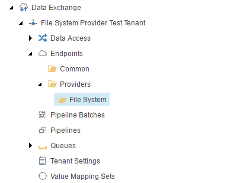
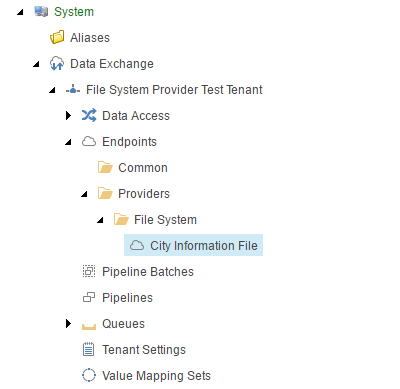

Add Endpoint for Source
===========================================================

An *endpoint* is needed to identify the source file within the
synchronization process.

First you must create the folder into which file system endpoints
can be added.

1. Navigate to **Endpoints > Providers**.
2. Add the following item:

    +-------------------+---------------------------------------------------------------------+
    | Template          | **File System Endpoints Root**                                      |
    +-------------------+---------------------------------------------------------------------+

    .. hint:: 
    
        This template is a command template. It does not prompt for the 
        item name. The command template assigns the item name automatically.

The new endpoints folder in Content Editor.

Next you must add an endpoint to the folder.

3. Add the following item:

    +-------------------+---------------------------------------------------------------------+
    | Template          | **Text File Endpoint**                                              |
    +-------------------+---------------------------------------------------------------------+
    | Name              | **City Information File**                                           |
    +-------------------+---------------------------------------------------------------------+

4. Set the following field values:

    +---------------------------------+---------------------------------------------------------------------+
    | Field                           | Value                                                               |
    +=================================+=====================================================================+
    | Path                            | **C:\\Sitecore\\cities.dat**                                        |
    +---------------------------------+---------------------------------------------------------------------+
    | Column Separator                | **,**                                                               |
    +---------------------------------+---------------------------------------------------------------------+
    | Column Headers in First Line    | **ticked**                                                          |
    +---------------------------------+---------------------------------------------------------------------+

5. Save the item.

The new endpoint in Content Editor.

