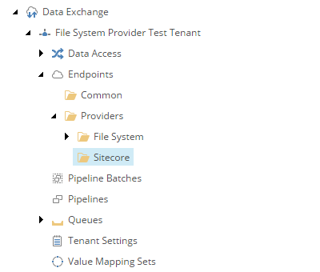
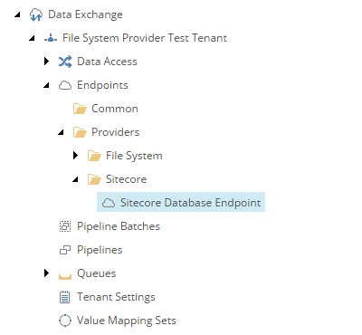

Add Endpoint for Target
===========================================================

An *endpoint* is needed to identify the Sitecore database within the
synchronization process.

First you must create the folder into which file system endpoints
can be added.

1. In Content Editor, navigate to your tenant.
2. Navigate to **Endpoints > Providers**.
3. Add the following item:

    +-------------------+---------------------------------------------------------------------+
    | Template          | **Sitecore Endpoints Root**                                         |
    +-------------------+---------------------------------------------------------------------+

    .. hint:: 
    
        This template is a command template. It does not prompt for the 
        item name. The command template assigns the item name automatically.

The new endpoints folder in Content Editor.

Next you must add an endpoint to the folder.

4. Add the following item:

    +-------------------+---------------------------------------------------------------------+
    | Template          | **Sitecore Item Model Repository Endpoint**                         |
    +-------------------+---------------------------------------------------------------------+
    | Name              | **Sitecore Database Endpoint**                                      |
    +-------------------+---------------------------------------------------------------------+

The new endpoint in Content Editor.

