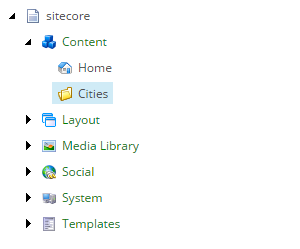

Add Folder to Hold New Sitecore Items
===========================================================

The result of the synchronization process is that Sitecore items
will be created for each row in the text file that is read.

A parent item is needed for these new Sitecore items.

1. In Content Editor, navigate **sitecore > Content**.
2. Add the following item:

    +-------------------+---------------------------------------------------------------------+
    | Template          | **Templates > Common > Folder**                                     |
    +-------------------+---------------------------------------------------------------------+
    | Name              | **Cities**                                                          |
    +-------------------+---------------------------------------------------------------------+

The new folder in Content Editor.

