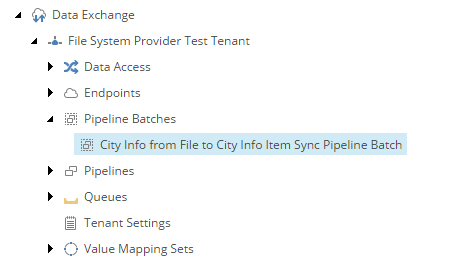

Add Pipeline Batch
===========================================================

A *pipeline batch* is used to run *pipelines*. A pipeline batch can
be run manually, through the Sitecore task scheduler or through the
Data Exchange Framework API.

1. Navigate to your tenant.
2. Navigate to **Pipeline Batches**.
3. Add the following item:

    +-------------------+---------------------------------------------------------------------+
    | Template          | **Pipeline Batch**                                                  |
    +-------------------+---------------------------------------------------------------------+
    | Name              | **City Info from File to City Info Item Sync Pipeline Batch**       |
    +-------------------+---------------------------------------------------------------------+

4. Set the following field values:

    +---------------------------------+---------------------------------------------------------------------+
    | Field                           | Value                                                               |
    +=================================+=====================================================================+
    | Pipelines                       | **Read City Info from File Pipeline**                               |
    +---------------------------------+---------------------------------------------------------------------+

    .. hint:: 
    
        Only add the pipeline specified. The other pipeline is called by this pipeline.

4. Save the item.

The pipeline batch in Content Editor.

