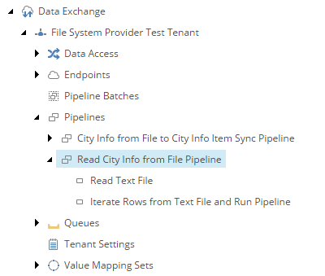

Add Pipeline Step to Iterate Data from Source
===========================================================

The second *pipeline step* iterates the data from the text field. For each
row, another *pipeline* is run.

1. Navigate to the *pipeline* **Read City Info from File Pipeline**.
2. Add the following item:

    +-------------------+---------------------------------------------------------------------+
    | Template          | **Iterate Data and Run Pipelines Pipeline Step**                    |
    +-------------------+---------------------------------------------------------------------+
    | Name              | **Iterate Rows from Text File and Run Pipeline**                    |
    +-------------------+---------------------------------------------------------------------+

3. Set the following field values:

    +---------------------------------+---------------------------------------------------------------------+
    | Field                           | Value                                                               |
    +=================================+=====================================================================+
    | Pipelines                       | **City Info from File to City Info Item Sync Pipeline**             |
    +---------------------------------+---------------------------------------------------------------------+

4. Save the item.
5. Make sure the pipeline steps are in the following order:

    * Read Text File
    * Iterate Rows from Text File and Run Pipeline

The pipeline in Content Editor.

