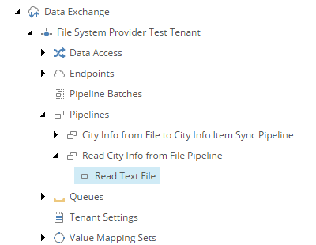

Add Pipeline Step to Read from Source
===========================================================

The first *pipeline step* reads the text file configured in the *endpoint*.

1. Navigate to the *pipeline* **Read City Info from File Pipeline**.
2. Add the following item:

    +-------------------+---------------------------------------------------------------------+
    | Template          | **Read Text File Pipeline Step**                                    |
    +-------------------+---------------------------------------------------------------------+
    | Name              | **Read Text File**                                                  |
    +-------------------+---------------------------------------------------------------------+

2. Set the following field values:

    +-------------------+---------------------------------------------------------------------+
    | Field             | Value                                                               |
    +===================+=====================================================================+
    | Endpoint From     | **File System > City Information File**                             |
    +-------------------+---------------------------------------------------------------------+

3. Save the item.

The pipeline in Content Editor.

