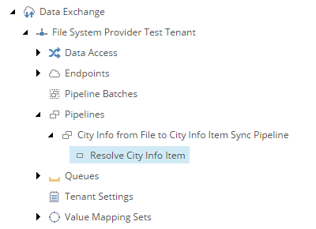

Add Pipline Step to Resolve Target Item
===========================================================

The first *pipeline step* determines whether or not a Sitecore item 
already exists for the row from the text file.

1. Navigate to the *pipeline* **City Info from File to City Info Item Sync Pipeline**.
2. Add the following item:

    +-------------------+---------------------------------------------------------------------+
    | Template          | **Resolve Sitecore Item Pipeline Step**                             |
    +-------------------+---------------------------------------------------------------------+
    | Name              | **Resolve City Info Item**                                          |
    +-------------------+---------------------------------------------------------------------+

3. Set the following field values:

    +-------------------------------------------+-----------------------------------------------------------+
    | Field                                     | Value                                                     |
    +===========================================+===========================================================+
    | | Template for new item                   | | **Templates > User Defined >**                          |
    | |                                         | | **City Information**                                    |
    +-------------------------------------------+-----------------------------------------------------------+
    | | Value accessor for name for new object  | | **Data Access > Value Accessor Sets >**                 |
    | |                                         | | **Providers > File System >**                           |
    | |                                         | | **File System > City Information File**                 |
    | |                                         | | **Fields > City**                                       |
    +-------------------------------------------+-----------------------------------------------------------+
    | | Endpoint to read data from              | | **Sitecore > Sitecore Database Endpoint**               |
    +-------------------------------------------+-----------------------------------------------------------+
    | | Identifier value accessor               | | **Value Accessor Sets > Providers >**                   |
    | |                                         | | **File System > City Information File Fields >**        |
    | |                                         | | **Identifier**                                          |
    +-------------------------------------------+-----------------------------------------------------------+
    | | Identifier object location              | | **Pipeline Context Source**                             |
    +-------------------------------------------+-----------------------------------------------------------+
    | | Resolved object location                | | **Pipeline Context Target**                             |
    +-------------------------------------------+-----------------------------------------------------------+
    | | Parent for item to resolve              | | **sitecore > content > Cities**                         |
    +-------------------------------------------+-----------------------------------------------------------+
    | | Value accessor for Sitecore item field  | | **Data Access > Value Accessor Sets >**                 |
    | | used to match the identifier value      | | **Providers > Sitecore > City Information**             |
    | |                                         | | **Item Fields > Identifier**                            |                         
    +-------------------------------------------+-----------------------------------------------------------+

    .. hint:: 
    
        Hopefully, most of the fields are self-explanatory. One field 
        that may be confusing to you is **Identifier object location**.
        The *pipeline step processor* uses this field to determine where
        to find the source object.

        This value is specified in the pipeline step processor that 
        iterates the data that is read from the text file. This is 
        configured in a later step. 

4. Save the item.

The pipeline in Content Editor.

