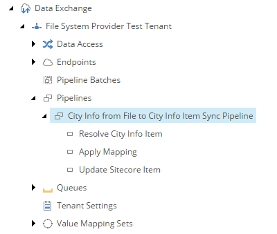

Add Pipeline Step to Update Sitecore Item
===========================================================

The *target* object represents a Sitecore item, but it is not, itself, 
a Sitecore item. The actual Sitecore item must be updated. A 
*pipeline step* must be configured in order for this to happen.

1. Navigate to the *pipeline* **City Info from File to City Info Item Sync Pipeline**.
2. Add the following item:

    +-------------------+---------------------------------------------------------------------+
    | Template          | **Update Sitecore Item Pipeline Step**                              |
    +-------------------+---------------------------------------------------------------------+
    | Name              | **Update Sitecore Item**                                            |
    +-------------------+---------------------------------------------------------------------+

3. Set the following field values:

    +------------------------------------------------------+------------------------------------------------+
    | Field                                                | Value                                          |
    +======================================================+================================================+
    | Endpoint for Sitecore item model repository          | **Sitecore > Sitecore Database Endpoint**      |
    +------------------------------------------------------+------------------------------------------------+

4. Save the item.
5. Make sure the pipeline steps are in the following order:

    * Resolve City Info Item
    * Apply Mapping
    * Update Sitecore Item

The pipeline in Content Editor.

