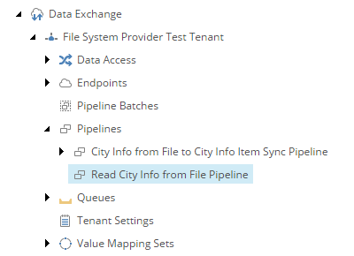

Add Pipeline to Read Source
===========================================================

You just configured the *pipeline* **City Info from File to City Info Item Sync Pipeline**, 
which handles a single row from a text file. Now you must configure  
the pipeline that reads the datacfrom the file, and handles each 
row by passing it to **City Info from File to City Info Item Sync Pipeline**.

1. In Content Editor, navigate to your tenant.
2. Navigate to **Pipelines**.
3. Add the following item:

    +-------------------+---------------------------------------------------------------------+
    | Template          | **Pipeline**                                                        |
    +-------------------+---------------------------------------------------------------------+
    | Name              | **Read City Info from File Pipeline**                               |
    +-------------------+---------------------------------------------------------------------+

The pipeline in Content Editor.

