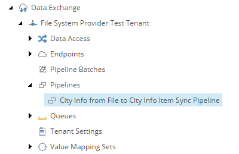

Add Pipeline to Sync Single Record from Source
===========================================================

The synchronization process you are modeling consists of two *pipelines*.
The first pipeline reads data from a *source* object, which is a text
file. The second pipeline handles a single row from the text file.

The the first pipeline calls the second pipeline, you must configure the 
second pipeline before you can configure the first.

1. In Content Editor, navigate to your tenant.
2. Navigate to **Pipelines**.
3. Add the following item:

    +-------------------+---------------------------------------------------------------------+
    | Template          | **Pipeline**                                                        |
    +-------------------+---------------------------------------------------------------------+
    | Name              | **City Info from File to City Info Item Sync Pipeline**             |
    +-------------------+---------------------------------------------------------------------+

The pipeline in Content Editor.

