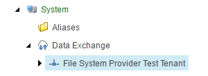

Add Tenant
===========================================================

1. In Sitecore, open Content Editor.
2. Navigate to **sitecore > system > Data Exchange**.
3. Add the following item:

    +-------------------+---------------------------------------------------------------------+
    | Template          | **Empty Data Exchange Template**                                    |
    +-------------------+---------------------------------------------------------------------+
    | Name              | **File System Provider Test Tenant**                                |
    +-------------------+---------------------------------------------------------------------+

The new tenant in Content Editor.

    
