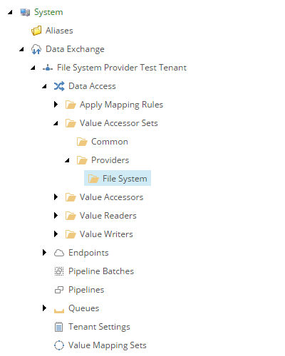
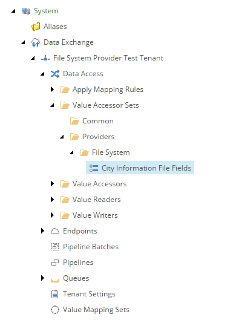
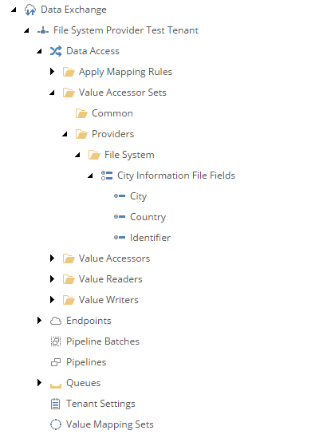

Add Value Accessor Set for Source
===========================================================

The source object is a row of data from the text file. The 
*value accessor set* defines the values that are available
in the row.

First you must create the folder into which the value accessor set
can be added.

1. Navigate to your tenant.
2. Navigate to **Data Access > Value Accessor Sets > Providers**.
3. Add the following item:

    +-------------------+---------------------------------------------------------------------+
    | Template          | **File System Value Accessor Sets Root**                            |
    +-------------------+---------------------------------------------------------------------+

    .. hint:: 
    
        This template is a command template. It does not prompt for the 
        item name. The command template assigns the item name automatically.

The new value accessor sets folder in Content Editor.

Next you must add a value accessor set to the folder.

4. Add the following item:

    +-------------------+---------------------------------------------------------------------+
    | Template          | **Array Value Accessor Set**                                        |
    +-------------------+---------------------------------------------------------------------+
    | Name              | **City Information File Fields**                                    |
    +-------------------+---------------------------------------------------------------------+

The new value accessor set in Content Editor.

Next you must add *value accessor* items to the value accessor set.

5. Add the following item:

    +-------------------+---------------------------------------------------------------------+
    | Template          | **Array Value Accessor**                                            |
    +-------------------+---------------------------------------------------------------------+
    | Name              | **Identifier**                                                      |
    +-------------------+---------------------------------------------------------------------+

6. Set the following field values:

    +---------------------------------+---------------------------------------------------------------------+
    | Field                           | Value                                                               |
    +=================================+=====================================================================+
    | Position                        | **1**                                                               |
    +---------------------------------+---------------------------------------------------------------------+

7. Save the item.
8. Navigate back to the value accessor set item.
9. Add the following item:

    +-------------------+---------------------------------------------------------------------+
    | Template          | **Array Value Accessor**                                            |
    +-------------------+---------------------------------------------------------------------+
    | Name              | **Country**                                                         |
    +-------------------+---------------------------------------------------------------------+

10. Set the following field values:

    +---------------------------------+---------------------------------------------------------------------+
    | Field                           | Value                                                               |
    +=================================+=====================================================================+
    | Position                        | **2**                                                               |
    +---------------------------------+---------------------------------------------------------------------+

11. Save the item.
12. Navigate back to the value accessor set item.
13. Add the following item:

    +-------------------+---------------------------------------------------------------------+
    | Template          | **Array Value Accessor**                                            |
    +-------------------+---------------------------------------------------------------------+
    | Name              | **City**                                                            |
    +-------------------+---------------------------------------------------------------------+

14. Set the following field values:

    +---------------------------------+---------------------------------------------------------------------+
    | Field                           | Value                                                               |
    +=================================+=====================================================================+
    | Position                        | **3**                                                               |
    +---------------------------------+---------------------------------------------------------------------+

15. Save the item.

The new value accessors in Content Editor.

