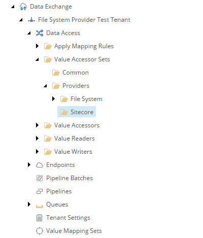
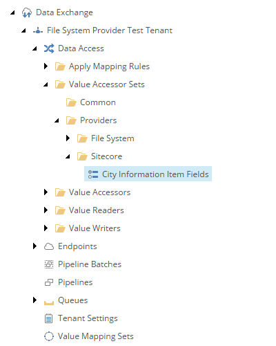
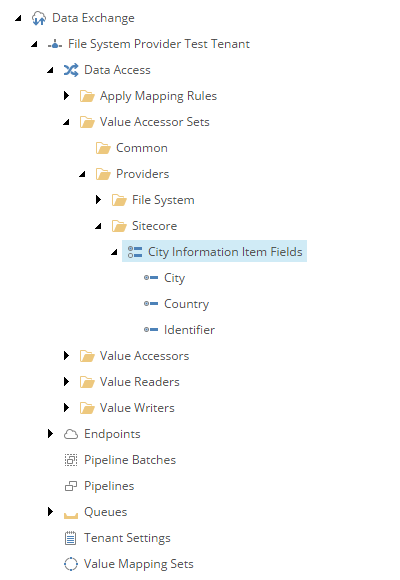

Add Value Accessor Set for Target
===========================================================

The target object is a Sitecore item. The *value accessor set* defines 
the fields that can be set on the item.

First you must create the folder into which the value accessor set
can be added.

1. Navigate to your tenant.
2. Navigate to **Data Access > Value Accessor Sets > Providers**.
3. Add the following item:

    +-------------------+---------------------------------------------------------------------+
    | Template          | **Sitecore Value Accessor Sets Root**                               |
    +-------------------+---------------------------------------------------------------------+

    .. hint:: 
    
        This template is a command template. It does not prompt for the 
        item name. The command template assigns the item name automatically.

    .. note::

        If you are configuring this provider on an existing *tenant*, 
        this folder may already exist. 

The new value accessor sets folder in Content Editor.

Next you must add a value accessor set to the folder.

4. Add the following item:

    +-------------------+---------------------------------------------------------------------+
    | Template          | **Sitecore Item Field Value Accessor Set**                          |
    +-------------------+---------------------------------------------------------------------+
    | Name              | **City Information Item Fields**                                    |
    +-------------------+---------------------------------------------------------------------+

The new value accessor set in Content Editor.

Next you must add *value accessor* items to the value accessor set. 
These represent the fields that can be set on the Sitecore item
that is the target object in the mapping process.

5. Add the following item:

    +-------------------+---------------------------------------------------------------------+
    | Template          | **Sitecore Item Field Value Accessor**                              |
    +-------------------+---------------------------------------------------------------------+
    | Name              | **Identifier**                                                      |
    +-------------------+---------------------------------------------------------------------+

6. Set the following field values:

    +---------------------------------+---------------------------------------------------------------------+
    | Field                           | Value                                                               |
    +=================================+=====================================================================+
    | Field                           | **Templates > User Defined > City Information > Data > Identifier** |
    +---------------------------------+---------------------------------------------------------------------+

7. Save the item.
8. Navigate back to the value accessor set item.
9. Add the following item:

    +-------------------+---------------------------------------------------------------------+
    | Template          | **Sitecore Item Field Value Accessor**                              |
    +-------------------+---------------------------------------------------------------------+
    | Name              | **Country**                                                         |
    +-------------------+---------------------------------------------------------------------+

10. Set the following field values:

    +---------------------------------+---------------------------------------------------------------------+
    | Field                           | Value                                                               |
    +=================================+=====================================================================+
    | Field                           | **Templates > User Defined > City Information > Data > Country**    |
    +---------------------------------+---------------------------------------------------------------------+

11. Save the item.
12. Navigate back to the value accessor set item.
13. Add the following item:

    +-------------------+---------------------------------------------------------------------+
    | Template          | **Sitecore Item Field Value Accessor**                              |
    +-------------------+---------------------------------------------------------------------+
    | Name              | **City**                                                            |
    +-------------------+---------------------------------------------------------------------+

14. Set the following field values:

    +---------------------------------+---------------------------------------------------------------------+
    | Field                           | Value                                                               |
    +=================================+=====================================================================+
    | Field                           | **Templates > User Defined > City Information > Data > City**       |
    +---------------------------------+---------------------------------------------------------------------+

15. Save the item.

The new value accessors in Content Editor.

