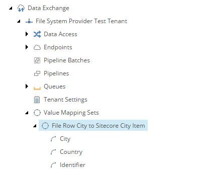

Add Value Mapping Set
===========================================================

The *value mapping set* is where you associate each *value accessor* 
from the *source* object with one from the *target* object.

1. In Content Editor, navigate to your tenant.
2. Navigate to **Value Mapping Sets**.
3. Add the following item:

    +-------------------+---------------------------------------------------------------------+
    | Template          | **Value Mapping Set**                                               |
    +-------------------+---------------------------------------------------------------------+
    | Name              | **File Row City to Sitecore City Item**                             |
    +-------------------+---------------------------------------------------------------------+
 
4. Add the following item:

    +-------------------+---------------------------------------------------------------------+
    | Template          | **Value Mapping**                                                   |
    +-------------------+---------------------------------------------------------------------+
    | Name              | **Identifier**                                                      |
    +-------------------+---------------------------------------------------------------------+
 
5. Set the following field values:

    +-----------------------------------+-------------------------------------------------------------------+
    | Field                             | Value                                                             |
    +===================================+===================================================================+
    | Value accessor for source object  | | **Data Access > Value Accessor Sets > Providers >**             |
    |                                   | | **File System > City Information File Fields > Identifier**     |
    +-----------------------------------+-------------------------------------------------------------------+
    | Value accessor for target object  | | **Data Access > Value Accessor Sets > Providers >**             |
    |                                   | | **Sitecore > City Information Item Fields > Identifier**        |
    +-----------------------------------+-------------------------------------------------------------------+

6. Save the item.
7. Navigate to **File Row City to Sitecore City Item**.
8. Add the following item:

    +-------------------+---------------------------------------------------------------------+
    | Template          | **Value Mapping**                                                   |
    +-------------------+---------------------------------------------------------------------+
    | Name              | **Country**                                                         |
    +-------------------+---------------------------------------------------------------------+
 
9. Set the following field values:

    +-----------------------------------+-------------------------------------------------------------------+
    | Field                             | Value                                                             |
    +===================================+===================================================================+
    | Value accessor for source object  | | **Data Access > Value Accessor Sets > Providers >**             |
    |                                   | | **File System > City Information File Fields > Country**        |
    +-----------------------------------+-------------------------------------------------------------------+
    | Value accessor for target object  | | **Data Access > Value Accessor Sets > Providers >**             |
    |                                   | | **Sitecore > City Information Item Fields > Country**           |
    +-----------------------------------+-------------------------------------------------------------------+

10. Save the item.
11. Navigate to **File Row City to Sitecore City Item**.
12. Add the following item:

    +-------------------+---------------------------------------------------------------------+
    | Template          | **Value Mapping**                                                   |
    +-------------------+---------------------------------------------------------------------+
    | Name              | **City**                                                            |
    +-------------------+---------------------------------------------------------------------+
 
13. Set the following field values:

    +-----------------------------------+-------------------------------------------------------------------+
    | Field                             | Value                                                             |
    +===================================+===================================================================+
    | Value accessor for source object  | | **Data Access > Value Accessor Sets > Providers >**             |
    |                                   | | **File System > City Information File Fields > City**           |
    +-----------------------------------+-------------------------------------------------------------------+
    | Value accessor for target object  | | **Data Access > Value Accessor Sets > Providers >**             |
    |                                   | | **Sitecore > City Information Item Fields > City**              |
    +-----------------------------------+-------------------------------------------------------------------+

14. Save the item.

The new value mapping set and value mappings in Content Editor.

