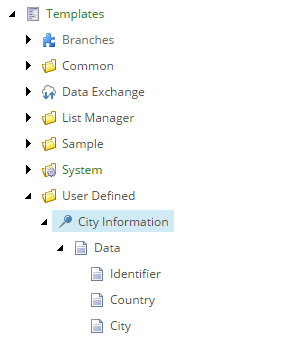

Create Template for Target
===========================================================

A Sitecore template is needed to represent the data that is read
from the file. Items based on this template are created using the
data that is read from the file.

1. Open Template Manager.
2. Add the following template:

    +-------------------+-----------------------------------------------------------------------------------+
    | Name              | **City Information**                                                              |
    +-------------------+-----------------------------------------------------------------------------------+
    | Base template     | **Templates > System > Templates > Standard template**                            |
    +-------------------+-----------------------------------------------------------------------------------+
    | Location          | **Templates > User Defined**                                                      |
    +-------------------+-----------------------------------------------------------------------------------+

5. Set the icon for this template to ``Office/32x32/pin.png``.
6. Add a section named **Data**.
7. Add the following field:

    +---------+-----------------------------------------------------------------------------------------------------------------------------------------------+
    | Name    | **Identifier**                                                                                                                                |
    +---------+-----------------------------------------------------------------------------------------------------------------------------------------------+
    | Type    | **Single-Line Text**                                                                                                                          |
    +---------+-----------------------------------------------------------------------------------------------------------------------------------------------+
    | Shared  | **ticked**                                                                                                                                    |
    +---------+-----------------------------------------------------------------------------------------------------------------------------------------------+

8. Add the following field:

    +---------+-----------------------------------------------------------------------------------------------------------------------------------------------+
    | Name    | **Country**                                                                                                                                   |
    +---------+-----------------------------------------------------------------------------------------------------------------------------------------------+
    | Type    | **Single-Line Text**                                                                                                                          |
    +---------+-----------------------------------------------------------------------------------------------------------------------------------------------+

9. Add the following field:

    +---------+-----------------------------------------------------------------------------------------------------------------------------------------------+
    | Name    | **City**                                                                                                                                      |
    +---------+-----------------------------------------------------------------------------------------------------------------------------------------------+
    | Type    | **Single-Line Text**                                                                                                                          |
    +---------+-----------------------------------------------------------------------------------------------------------------------------------------------+

The new template in Template Manager.

