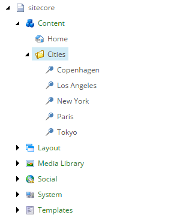
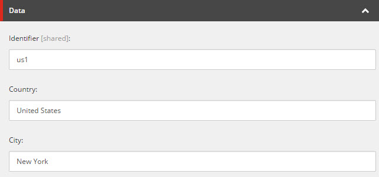

Test Pipeline Batch
===========================================================

The *pipeline batch* is ready to run.

1. In Content Editor, navigate to your *tenant*.
2. Navigate to **Pipeline Batches > City Info from File to City Info Item Sync Pipeline Batch**.
3. In the Content Editor ribbon, click **Run Pipeline Batch**.

    .. image:: _static/run-pipeline-batch-button.png
 
4. Click **OK**.

    .. image:: _static/pipeline-batch-started.png

In the pipeline batch summary you should see messages like the following: 

.. code-block:: none

    INFO  5 rows were read from the file. (pipeline step: Read Text File, endpoint: Read Text File)
    INFO  5 elements were iterated. (pipeline: Read City Info from File Pipeline, pipeline step: Iterate Rows from Text File and Run Pipeline)

In Content Editor, under **sitecore > Content > Cities**, you should see 5 items.

Each city item should have its fields populated. The following is an example of the New York item.

.. hint:: 

    If you change the text file and run the pipeline batch again, the 
    Sitecore items will be updated.

    If you remove a row from the Sitecore, the corresponding Sitecore
    item will not be deleted. You did not implement any logic to do this.

    If you change the identifier value for an existing row, a new 
    Sitecore item will be created. 
    
    In addition, the identifier value in the text file must be unique.
    Duplicate identifiers will result in duplicate Sitecore items and
    not all of the duplicate Sitecore items will be synchronized.

    If you change a field value on a Sitecore item, that value will be
    overwritten the next time the pipeline batch is run. In order for
    changes to the Sitecore item to result in the text file being updated,
    you must extend your provider.

Troubleshooting
~~~~~~~~~~~~~~~~~~~~~~~~~~~~~~~~~~~~~~~~~~~~~~~~~~~~~~~~~~~

This section describes common problems and their solutions.

**The button is disabled**

Make sure your tenant is enabled as described in :doc:`add-tenant`.

**The pipeline batch generates errors about missing pipeline context plugins**

If you get an error like the following, make sure that the correct 
*pipeline* is assigned to the pipeline batch:

.. code-block:: none

    ERROR  Pipeline context is missing at least one required plugin. (pipeline step: Resolve City Info Item...

If you get an error like the following, make sure that the *pipeline steps*
are in the correct order under the pipeline items.

.. code-block:: none
	
    ERROR  Pipeline context is missing at least one required plugin. (pipeline step: Iterate Rows from Text File and Run Pipeline...
