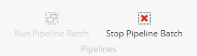

Data Exchange Framework
=================================================

.. contents:: What's new in version 1.2
   :depth: 2
   :local:

New features
-----------------------------

Added *mappings applied actions*
^^^^^^^^^^^^^^^^^^^^^^^^^^^^^^^^^^^^^^^^^^^^^^^^^

The purpose of mapping is to update a *target object*. Specifically, the mapping set
is able to change multiple values on a target object within a single command. This is 
called "applying" the mapping set.

:doc:`../../components/framework/data-mapping/mappings-applied-actions/index` allow you to configure something to happen when a mapping set 
is applied. 

Added new *apply mapping rules*
^^^^^^^^^^^^^^^^^^^^^^^^^^^^^^^^^^^^^^^^^^^^^^^^^

.. |objects-are-different-mapping-rule| replace:: :doc:`../../components/framework/data-mapping/apply-mapping-rules/objects-are-different-mapping-rule`

The following apply mapping rules are available: 

    * |objects-are-different-mapping-rule| - checks whether the *source object* and *target object* on the *mapping context* are different.

Added ability to cancel a *pipeline batch* that is running
^^^^^^^^^^^^^^^^^^^^^^^^^^^^^^^^^^^^^^^^^^^^^^^^^^^^^^^^^^^

A button has been added to the Sitecore Content Editor that allows 
a user to stop a *pipeline batch* that is running.

Added controls to prevent a *pipeline batch* from running multiple times concurrently
^^^^^^^^^^^^^^^^^^^^^^^^^^^^^^^^^^^^^^^^^^^^^^^^^^^^^^^^^^^^^^^^^^^^^^^^^^^^^^^^^^^^^^^^^

Previously, different users could start a *pipeline batch* 
that had already been started by another user. The default
*pipeline batch runner* has been updated to ensure a pipeline
batch cannot be started if it is already running within a 
specific process.

Added ability to specify destination for iterated data
^^^^^^^^^^^^^^^^^^^^^^^^^^^^^^^^^^^^^^^^^^^^^^^^^^^^^^^^^^^

The purpose of :doc:`../../components/framework/pipeline-steps/iterate-data-and-run-pipelines` 
is to iterate a collection of data, and for each member of the 
collection, run a set of *pipelines*. The point is for the 
pipelines that are run to have access to the member of the 
collection.

Previously, the *pipeline step* was hard-coded to always put the
member of the collection in a specific location. This meant that
the pipelines that were run had to know where to look.

This change makes it possible to configure where the member of 
the collection should be stored. This increases the reusability  
of this pipeline step.

Added compatibility with the Azure search provider
^^^^^^^^^^^^^^^^^^^^^^^^^^^^^^^^^^^^^^^^^^^^^^^^^^^^^^^^^^^

The "in process" *item model repository* uses Sitecore search API
to find items in the Sitecore database. The implementation used 
some LINQ options that are not supported by the Azure search provider.
Those LINQ options were replaced with options that are compatible.

API changes
-----------------------------

Added context awareness to *apply mapping rule*
^^^^^^^^^^^^^^^^^^^^^^^^^^^^^^^^^^^^^^^^^^^^^^^^^

Previously, when an *apply mapping rule* was run, it only had access to the following values:

    * The value being mapped
    * The source object
    * The target object

This meant that a lot of logic had to be implemented in the rule in order to determine whether or
not the value should be written to the target object. For example, the rule had to determine which
*value writer* to use to write to the target object. 

Now, the apply mapping rule has access to the following values:

    * The value being mapped (unchanged)
    * The value mapping, which provides access to the value accessors for
      the source object and the target object. This makes it much easier to
      read the current values from the source and target objects, which 
      makes it much easier to implement the apply mapping rule itself.
    * The *mapping context*, which provides access to the source and target 
      objects, among other things.    

Added collection for ignored mappings to *mapping context* 
^^^^^^^^^^^^^^^^^^^^^^^^^^^^^^^^^^^^^^^^^^^^^^^^^^^^^^^^^^^^^^^^^^^^^

When a mapping set is applied, some of the mappings may be
ignored. An example is because an *apply mapping rule* failed.

These mappings are now stored on the *mapping context* so they 
can be accessed later, if needed. 

Added tenant repository
^^^^^^^^^^^^^^^^^^^^^^^^^^^^^^^^^^^^^^^^^^^^^^^^^^^^^^^^^^^

The interface ``ITenantRepository`` provides access to *tenant* 
objects and the objects associated with each tenant, such as 
*pipeline batches* and *pipelines*.

An implementation of this interface is provided. ``SitecoreTenantRepository``
reads tenant objects from items in a Sitecore database.

Extended the Data Exchange Framework context
^^^^^^^^^^^^^^^^^^^^^^^^^^^^^^^^^^^^^^^^^^^^^^^^^^^^^^^^^^^

    * Added property to get/set a tenant repository.

Added ability to specify repository object status
^^^^^^^^^^^^^^^^^^^^^^^^^^^^^^^^^^^^^^^^^^^^^^^^^^^^^^^^^^^

Resolving objects from repositories is an essential part of working 
with Data Exchange Framework. Often, the logic for resolving objects
will automatically create a new object if the object does not already
exist in the repository. 

This creates a situation where you end up with the object you need, 
but you do not know if the object was resolved from the repository, 
or whether a new object was created. 

This is the problem this feature was designed to address. The enum 
``RepositoryObjectStatus`` was added to provide a higher level of
detail when resolving an object from a repository.

Added ability to associate metadata with work queue entries
^^^^^^^^^^^^^^^^^^^^^^^^^^^^^^^^^^^^^^^^^^^^^^^^^^^^^^^^^^^

Previously, a work queue only stored entries. Now, each entry
automatically has a ``WorkQueueEntryMetaData`` object associated
with it. 

This object can be used to store any additional data that is needed
to adequately describe the entry. For example, the status of the
entry in the queue is stored in this way.

Added async support
^^^^^^^^^^^^^^^^^^^^^^^^^^^^^^^^^^^^^^^^^^^^^^^^^^^^^^^^^^^

Synchronous and asynchronous methods are now available on the following interfaces:

    * Item model repository
    * Pipeline batch runner
    * Pipeline batch processor
    * Pipeline processor
    * Pipeline step processor
    * Work queue processor

Deprecated types
^^^^^^^^^^^^^^^^^^^^^^^^^^^^^^^^^^^^^^^^^^^^^^^^^^^^^^^^^^^

    * ``IPipelineBatchRepository`` has been replaced with ``ITenantRepository``.
    * ``SitecorePipelineBatchRepository`` has been replaced with ``SitecoreTenantRepository``.

