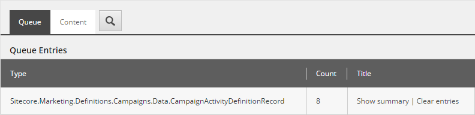
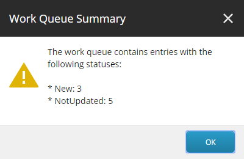
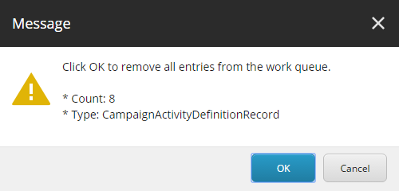

Data Exchange Framework
=================================================

.. important:: 

    If you created a custom provider, Data Exchange Framework
    version 1.4 introduces breaking changes that will require
    you update your provider.

    The easiest way to identify these breaking changes is to 
    recompile your provider using the dlls from version 1.4.

.. contents:: What's new in version 1.4
   :depth: 2
   :local:

New features
-----------------------------

Work queue enhancements for Content Editors
^^^^^^^^^^^^^^^^^^^^^^^^^^^^^^^^^^^^^^^^^^^^^^^^^^^^^^^^^^^^^^^^^^^^

Content Editor users can select a *work queue endpoint* and immediately 
see information about the current contents of the *work queue*.

Clicking the link to show summary displays additional information about
the current contents of the *work queue*.

Clicking the link to clear entries allows a Content Editor user to 
remove entries in the queue. This  option is especially helpful
when a user is troubleshooting a *pipeline* that uses the
*work queue* functionality.

Work queue enhancements for developers
^^^^^^^^^^^^^^^^^^^^^^^^^^^^^^^^^^^^^^^^^^^^^^^^^^^^^^^^^^^^^^^^^^^^

The *work queue* API was rewritten to emphasize a *work queue* 
typically only holds one type of entry. This greatly simplifies
the API.

"Delta settings" feature moved from Dynamics CRM Provider into framework
^^^^^^^^^^^^^^^^^^^^^^^^^^^^^^^^^^^^^^^^^^^^^^^^^^^^^^^^^^^^^^^^^^^^^^^^^^^^^
*Delta settings* are used to configure date offsets. For example, if you
only want to read records from a system that have changed within the past
24 hours, *delta settings* can be used to specify a date range where the
minimum date is 24 hours earlier than the current date.

This functionality was originally available in the Dynamics CRM Provider.
It has been moved into the framework so it is available to any provider
that needs it.

Value mapping enhancements
^^^^^^^^^^^^^^^^^^^^^^^^^^^^^^^^^^^^^^^^^^^^^^^^^^^^^^^^^^^^^^^^^^^^^^^^^^^^^

The value mapping functionality is used to read values from a *source object*
and write those values to a *target object*. When values are mapped, the 
component that does the mapping indicates whether or not the mappings were
applied.

When mappings are applied, instructions called *mappings applied actions*
can be run. A new feature called *mappings applied action rules* has been
added. A *mappings applied action rule* allows you to configure conditions 
that must be met in order for a *mappings applied action* to be applied.

Feedback during tenant creation
^^^^^^^^^^^^^^^^^^^^^^^^^^^^^^^^^^^^^^^^^^^^^^^^^^^^^^^^^^^^^^^^^^^^^^^^^^^^^

The functionality to create tenants using branch templates has been 
refactored into the framework, and is available for any provider to
use.

In addition, a progress box is displayed while the tenant is created
in order to provide feedback during the tenant creation process.

Pipeline Batch control button enhancements
^^^^^^^^^^^^^^^^^^^^^^^^^^^^^^^^^^^^^^^^^^^^^^^^^^^^^^^^^^^^^^^^^^^^^^^^^^^^^

The Content Editor buttons that are used to start and stop *pipeline batch*
execution are hidden unless a *pipeline batch* item is selected. Previously
these buttons were simply disabled.

Simplified interface for BaseItemModelConverter
^^^^^^^^^^^^^^^^^^^^^^^^^^^^^^^^^^^^^^^^^^^^^^^^^^^^^^^^^^^^^^^^^^^^^^^^^^^^^

As is evident from the type name, ``BaseItemModelConverter`` converts an 
``ItemModel`` into another type. This type now only supports a generic
type to specify the target type.

SDK for provider developers
^^^^^^^^^^^^^^^^^^^^^^^^^^^^^^^^^^^^^^^^^^^^^^^^^^^^^^^^^^^^^^^^^^^^^^^^^^^^^

This optional product provides functionality useful to developers building
providers for Data Exchange Framework. New features will be added in 
future versions of the SDK.

The first feature available is a "provider generator". A large number 
of templates, items and insert options must be created in Sitecore 
for each new provider. Creating these is a very tedious and error-
prone task when performed manually.

The SDK provides the ability to automatically generate most of these.
For more information see :doc:`../../implementing-a-provider/index`.

API changes 
-----------------------------
    * :download:`Sitecore.DataExchange.dll <_static/Sitecore.DataExchange.dll 1.3 to 1.4.html>`
    * :download:`Sitecore.DataExchange.DataAccess.dll <_static/Sitecore.DataExchange.DataAccess.dll 1.3 to 1.4.html>`
    * :download:`Sitecore.DataExchange.Local.dll <_static/Sitecore.DataExchange.Local.dll 1.3 to 1.4.html>`

Bugs fixes
-----------------------------

    * ``InProcItemModelRepository`` does not convert ``ItemModel`` fields to string before writing to Sitecore.  (153559)
