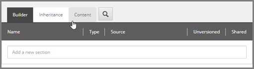

Create Template for Value Accessor Set
===================================================
A value accessor set is the component that is used to 
group a set of related value accessor objects. If a 
value accessor is like a property in C#, a value 
accessor set is like a class.

There usually is no need to create a custom value 
accessor set. A value accessor set can hold any 
kind of value accessors.

While this is true at the Data Exchange Framework 
API layer, this is not usually the case when it 
comes time to configure a value accessor set.

For example, if you are configuring a value accessor 
set that represents the different properties you can 
read and write on a CRM contact, it is pretty likely 
that most - if not all - of your value accessors are 
of a specific type.

So when it comes time to configure a value accessor 
set, it is often helpful to only display value 
accessors that make sense. This is where a custom 
template can be helpful.

You can create a custom template that only supports 
certain types of value accessors. In this example,
it makes sense to only allow value accessors that 
are based on the **Array Value Accessor** template.
This section describes how to create this.

This section describes how to create the template 
that can represent a value accessor set used to 
configure the value accessors used to read values 
from a text file.

.. contents:: In this topic:
   :local:

Create Template
---------------------------------------------------
1. In Sitecore, open Template Manager.
2. Add a new template.

.. image:: _static/add-template.png

3. Enter the following values:

.. |base-template| replace:: **Templates > Data Exchange > Framework > Data Access > Value Accessor Sets > Value Accessor Set**

+---------------------------+---------------------------------------------------------------------+
| Name                      | **Array Value Accessor Set**                                        |
+---------------------------+---------------------------------------------------------------------+
| Base template             | |base-template|                                                     |
+---------------------------+---------------------------------------------------------------------+

4. Click **Next**.

5. Select **Templates > Data Exchange > Providers > File System > Data Access > Value Accessors**.

.. image:: _static/location-set.png

6. Click **Next**.
7. Click **Close**.

.. image:: _static/template-created.png

Set Icon
---------------------------------------------------
1. Select the new template.

2. Click the **Content** tab.

3. Click the icon.

.. image:: _static/icon-set.png

4. Enter ``Office/32x32/radio_button_group.png``

5. Click **OK**.
