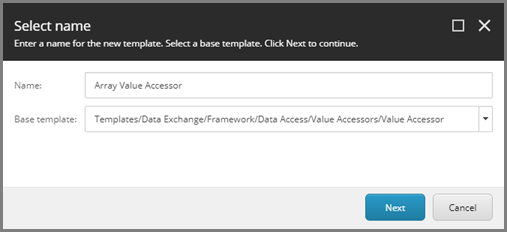
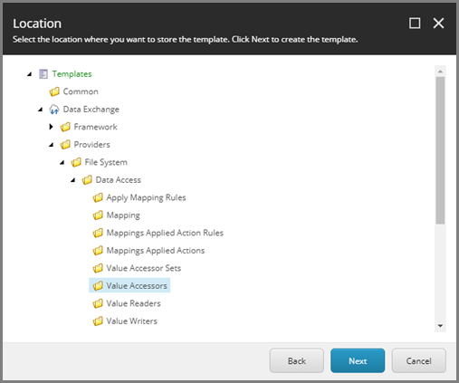
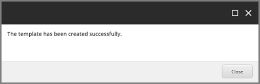
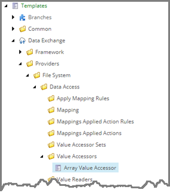
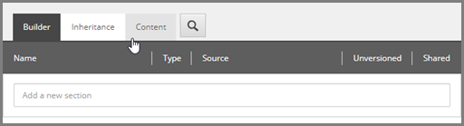
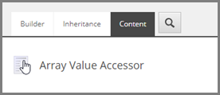
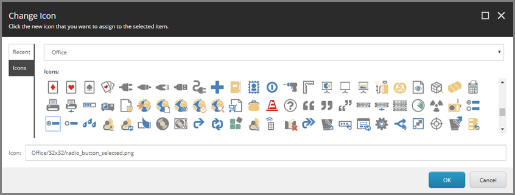

Create Template for Value Accessor
===================================================
In this example, each row from a text file is split into
an array of values. The individual values in the array
can be used in a data synchronization process. A template
is needed to allow a user to specify which value in the 
array to read.

.. contents:: In this topic:
   :local:

Create Template
---------------------------------------------------
1. In Sitecore, open Template Manager.
2. Add a new template.

.. image:: _static/add-template.png

3. Enter the following values:

.. |base-template| replace:: **Templates > Data Exchange > Framework > Data Access > Value Accessors > Value Accessor**

+---------------------------+---------------------------------------------------------------------+
| Name                      | **Array Value Accessor**                                            |
+---------------------------+---------------------------------------------------------------------+
| Base template             | |base-template|                                                     |
+---------------------------+---------------------------------------------------------------------+

4. Click **Next**.

5. Select **Templates > Data Exchange > Providers > File System > Data Access > Value Accessors**.

6. Click **Next**.
7. Click **Close**.

Set Icon
---------------------------------------------------
1. Select the new template.

2. Click the **Content** tab.

3. Click the icon.

4. Enter ``Office/32x32/radio_button_selected.png``

5. Click **OK**.

Add Fields
---------------------------------------------------
1. Add a template section named **Settings**.
2. Add the following field:

+---------------------------+---------------------------------------------------------------------+
| Name                      | **Position**                                                        |
+---------------------------+---------------------------------------------------------------------+
| Type                      | **Integer**                                                         |
+---------------------------+---------------------------------------------------------------------+
| Shared                    | **ticked**                                                          |
+---------------------------+---------------------------------------------------------------------+

3. Save the item.
