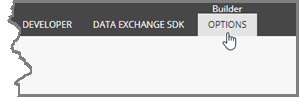

Set Default Values on Value Accessor Set Template
===================================================

.. contents:: In this topic:
   :local:

Add Standard Values to Template
---------------------------------------------------

1. In Sitecore, open Template Manager.
2. Navigate to **Templates > Data Exchange > Providers > File System > Data Access > Value Accessor Sets > Array Value Accessor Set**
3. Click the **Builder** tab.

4. In the ribbon, click **Builder OPTIONS**.

5. Click **Standard values**.

6. Select the new item.

Set Insert Options on Standard Values Item
---------------------------------------------------

1. In the ribbon, click **CONFIGURE**.

2. In the Insert Options chunk, click **Assign**.

3. Remove the select templates and add the template **Array Value Accessor**.

4. Click **OK**.
5. Save the item.
