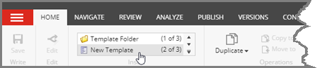
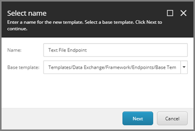
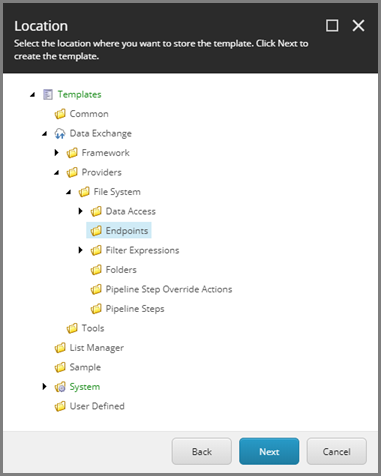
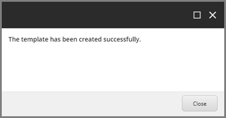
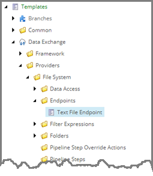
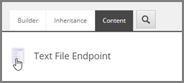
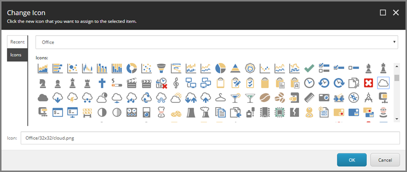
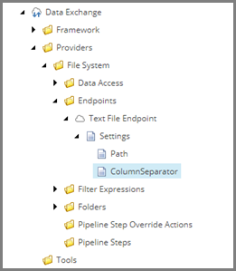
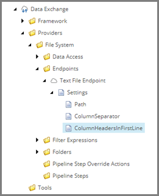

Create Template For Endpoint
===================================================
Data synchronization processes are modeled using the 
Sitecore Content Editor. This allows people doing the
configuration to use a familiar interface.

But this sort of configuration requires templates be
available. A template is needed that represents a
text file that can be read from.

.. contents:: In this topic:
   :local:

Create Template
---------------------------------------------------
1. In Sitecore, open Template Manager.
2. Add a new template.

3. Enter the following values:

.. |base-template| replace:: **Templates > Data Exchange > Framework > Endpoints > Base Templates > Base Endpoint**

+---------------------------+---------------------------------------------------------------------+
| Name                      | **Text File Endpoint**                                              |
+---------------------------+---------------------------------------------------------------------+
| Base template             | |base-template|                                                     |
+---------------------------+---------------------------------------------------------------------+

4. Click **Next**.

5. Select **Templates > Data Exchange > Providers > File System > Endpoints**.

6. Click **Next**.
7. Click **Close**.

Set Icon
---------------------------------------------------
1. Select the new template.

2. Click the **Content** tab.

.. image:: _static/content-tab.png

3. Click the icon.

4. Enter ``Office/32x32/cloud.png``

5. Click **OK**.

Add Fields
---------------------------------------------------
1. Add a template section named **Settings**.
2. Add the following field:

+---------------------------+---------------------------------------------------------------------+
| Name                      | **Path**                                                            |
+---------------------------+---------------------------------------------------------------------+
| Type                      | **Single-Line Text**                                                |
+---------------------------+---------------------------------------------------------------------+
| Shared                    | **ticked**                                                          |
+---------------------------+---------------------------------------------------------------------+

3. Add the following field:

+---------------------------+---------------------------------------------------------------------+
| Name                      | **ColumnSeparator**                                                 |
+---------------------------+---------------------------------------------------------------------+
| Type                      | **Single-Line Text**                                                |
+---------------------------+---------------------------------------------------------------------+
| Shared                    | **ticked**                                                          |
+---------------------------+---------------------------------------------------------------------+

4. Save the item.
5. Navigate to the item **ColumnSeparator**.

6. Set the following field value:

+---------------------------+---------------------------------------------------------------------+
| Name                      | **Title**                                                           |
+---------------------------+---------------------------------------------------------------------+
| Value                     | **Column Separator**                                                |
+---------------------------+---------------------------------------------------------------------+

7. Save the item.
8. Navigate to the template **Text File Endpoint**.
9. Add the following field:

+---------------------------+---------------------------------------------------------------------+
| Name                      | **ColumnHeadersInFirstLine**                                        |
+---------------------------+---------------------------------------------------------------------+
| Type                      | **Checkbox**                                                        |
+---------------------------+---------------------------------------------------------------------+
| Shared                    | **ticked**                                                          |
+---------------------------+---------------------------------------------------------------------+

10. Save the item.
11. Navigate to the item **ColumnHeadersInFirstLine**.

12. Set the following field value:

+---------------------------+---------------------------------------------------------------------+
| Name                      | **Title**                                                           |
+---------------------------+---------------------------------------------------------------------+
| Value                     | **Column Headers in First Line**                                    |
+---------------------------+---------------------------------------------------------------------+

13. Save the item.
