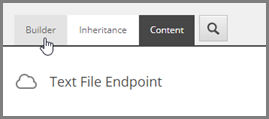
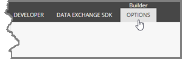
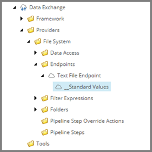

Set Default Values on Endpoint Template
===================================================

.. contents:: In this topic:
   :local:

Add Standard Values to Template
---------------------------------------------------

1. In Sitecore, open Template Manager.
2. Navigate to **Templates > Data Exchange > Providers > File System > Endpoints > Text Field Endpoint**
3. Click the **Builder** tab.

4. In the ribbon, click **Builder OPTIONS**.

5. Click **Standard values**.

.. image:: _static/standard-values-button.png

6. Select the new item.

Set Default Values on Standard Values Item
---------------------------------------------------

1. Set the following field value:

+---------------------------+---------------------------------------------------------------------+
| Name                      | **Column Separator**                                                |
+---------------------------+---------------------------------------------------------------------+
| Value                     | **,**                                                               |
+---------------------------+---------------------------------------------------------------------+

2. Set the following field value:

+---------------------------+---------------------------------------------------------------------+
| Name                      | **Column Headers in First Line**                                    |
+---------------------------+---------------------------------------------------------------------+
| Value                     | **ticked**                                                          |
+---------------------------+---------------------------------------------------------------------+

3. Set the following field value:

.. |converter-type| replace:: **Examples.DataExchange.Providers.FileSystem.TextFileEndpointConverter, Examples.DataExchange.Providers.FileSystem**

+---------------------------+---------------------------------------------------------------------+
| Name                      | **Converter Type**                                                  |
+---------------------------+---------------------------------------------------------------------+
| Value                     | |converter-type|                                                    |
+---------------------------+---------------------------------------------------------------------+

.. hint::

    The field **Converter Type** is in the section **Data Exchange Framework**. 
    You might need to expand the section before you see the field.

4. Save the item.
