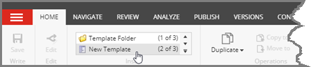
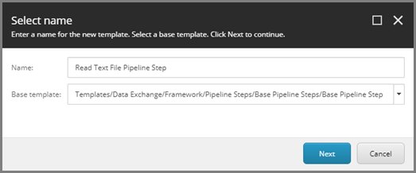
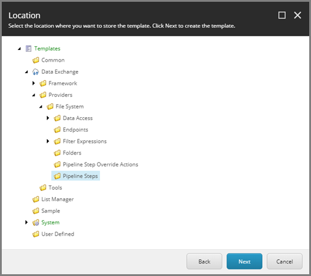
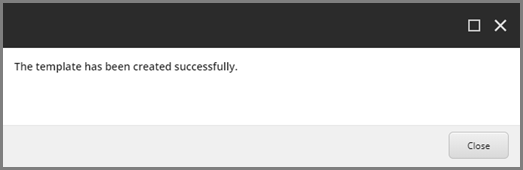
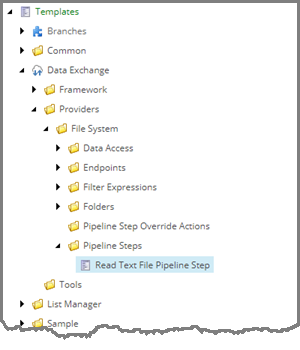
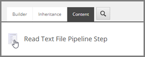
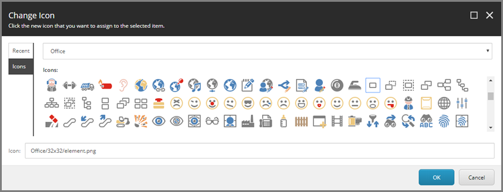
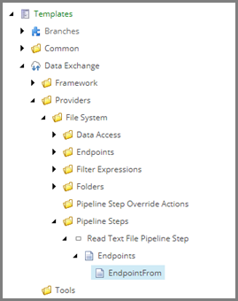

Create Template for Pipeline Step
===================================================
In this example, a pipeline step is used to read data
from a text file. A template is needed to allow a user
to specify which text file (endpoint) to read from.

.. contents:: In this topic:
   :local:

Create Template
---------------------------------------------------
1. In Sitecore, open Template Manager.
2. Add a new template.

3. Enter the following values:

.. |base-template| replace:: **Templates > Data Exchange > Framework > Pipeline Steps > Base Templates > Base Pipeline Step**

+---------------------------+---------------------------------------------------------------------+
| Name                      | **Read Text File Pipeline Step**                                    |
+---------------------------+---------------------------------------------------------------------+
| Base template             | |base-template|                                                     |
+---------------------------+---------------------------------------------------------------------+

4. Click **Next**.

5. Select **Templates > Data Exchange > Providers > File System > Endpoints**.

6. Click **Next**.
7. Click **Close**.

Set Icon
---------------------------------------------------
1. Select the new template.

2. Click the **Content** tab.

.. image:: _static/content-tab.png

3. Click the icon.

4. Enter ``Office/32x32/element.png``

5. Click **OK**.

Add Fields
---------------------------------------------------
1. Add a template section named **Endpoints**.
2. Add the following field:

.. |endpoint-from-source| replace:: ``query:./ancestor-or-self::*[@@templateid='{327A381B-59F8-4E88-B331-BEBC7BD87E4E}']//descendant-or-self::*[@@templateid='TEMPLATE-ID']``

+---------------------------+---------------------------------------------------------------------+
| Name                      | **EndpointFrom**                                                    |
+---------------------------+---------------------------------------------------------------------+
| Type                      | **Droptree**                                                        |
+---------------------------+---------------------------------------------------------------------+
| Source                    | |endpoint-from-source|                                              |
+---------------------------+---------------------------------------------------------------------+
| Shared                    | **ticked**                                                          |
+---------------------------+---------------------------------------------------------------------+

.. important::

    You must replace ``TEMPLATE-ID`` with the id for the template 
    named **File System Endpoints Root**. This is the template 
    that represents folder used to store endpoint items for 
    your provider. 
    
    This template was created automatically when the Data Exchange
    Framework SDK was used to create the provider. The template is 
    located under **sitecore > templates > Data Exchange > Providers > File System > Folders**.

.. note::

    The query used for this field limits the droptree to the 
    endpoints in the current tenant that are in the folder 
    used to organize endpoints for this provider.

    The id **{327A381B-59F8-4E88-B331-BEBC7BD87E4E}** is for 
    the template that represents a tenant. This is a template 
    that is provided with the framework. You should not change 
    this value.

    The id you use when you replace ``TEMPLATE-ID`` is for the 
    item used organize the endpoints for this provider.

3. Save the item.
4. Navigate to the item **EndpointFrom**.

5. Set the following field value:

+---------------------------+---------------------------------------------------------------------+
| Name                      | **Title**                                                           |
+---------------------------+---------------------------------------------------------------------+
| Value                     | **Endpoint From**                                                   |
+---------------------------+---------------------------------------------------------------------+

6. Save the item.

.. important::

    A message will appear when you save the item that indicates
    the item contains broken links. This is expected behavior 
    related to the expression set in step 2. Click **OK** to 
    continue.

    .. image:: _static/endpoint-from-source-message.png
