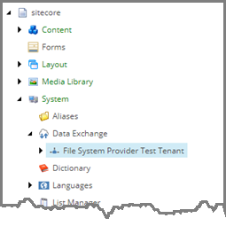
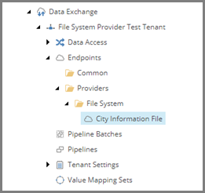

Add Endpoint for Source File
===================================================
An endpoint is needed to identify the text file that
will be read.

1. In Content Editor, select the tenant.

2. Navigate to **Endpoints > Providers**.

3. Add the following item:

+---------------------------+---------------------------------------------------------------------+
| Template                  | **File System Endpoints**                                           |
+---------------------------+---------------------------------------------------------------------+

.. hint::

    This template is a command template. It does not 
    prompt for the item name. The command template 
    assigns the item name automatically.

4. Select the new item.

5. Add the following item:

+---------------------------+---------------------------------------------------------------------+
| Template                  | **Text File Endpoint**                                              |
+---------------------------+---------------------------------------------------------------------+
| Name                      | **City Information File**                                           |
+---------------------------+---------------------------------------------------------------------+

6. Select the new item.

7. Set the following field values:

.. |headers-field| replace:: Column Headers in First Line

+---------------------------+---------------------------------------------------------------------+
| Field                     | Value                                                               |
+===========================+=====================================================================+
| Path                      | **C:\\Sitecore\\cities.dat**                                        |
+---------------------------+---------------------------------------------------------------------+
| Column Separator          | **,**                                                               |
+---------------------------+---------------------------------------------------------------------+
| |headers-field|           | **ticked**                                                          |
+---------------------------+---------------------------------------------------------------------+

8. Save the item.
