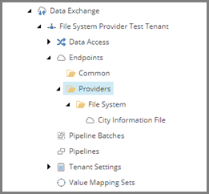
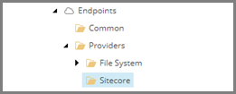

Add Endpoint for Target Items
===================================================
An endpoint is needed to identify the Sitecore database 
where the Sitecore items will be created.

1. In Content Editor, select the tenant.

.. image:: _static/select-new-tenant.png

2. Navigate to **Endpoints > Providers**.

3. Add the following item:

+---------------------------+---------------------------------------------------------------------+
| Template                  | **Sitecore Endpoints**                                              |
+---------------------------+---------------------------------------------------------------------+

.. hint::

    This template is a command template. It does not 
    prompt for the item name. The command template 
    assigns the item name automatically.

4. Select the new item.

5. Add the following item:

+---------------------------+---------------------------------------------------------------------+
| Template                  | **Sitecore Item Model Repository Endpoint**                         |
+---------------------------+---------------------------------------------------------------------+
| Name                      | **Sitecore Database Endpoint**                                      |
+---------------------------+---------------------------------------------------------------------+

