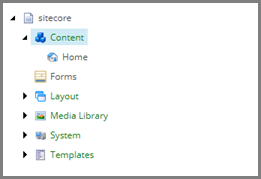
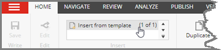
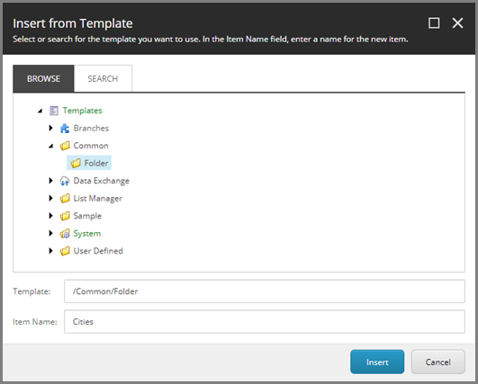

Add Parent Item for Target Items
===================================================
During the data synchronization process, a Sitecore item
is created for each row in the text file. These items
represent the cities described in the file. These city
items are added as child items on another Sitecore item:
the parent item.

The parent item must be created before child items can
be created.

1. In Content Editor, navigate to **sitecore > Content**

2. In the ribbon, click **Insert from template**.

3. Add the following item:

+---------------------------+---------------------------------------------------------------------+
| Template                  | **Templates > Common > Folder**                                     |
+---------------------------+---------------------------------------------------------------------+
| Item name                 | **Cities**                                                          |
+---------------------------+---------------------------------------------------------------------+

4. Click **Insert**.

