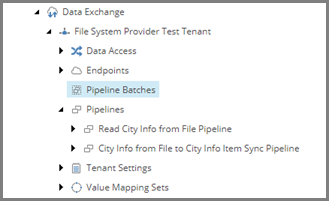

Add Pipeline Batch
===================================================
In order to run a pipeline, you must configure a 
pipeline batch. This is basically the runtime for
a pipeline. 

1. In Content Editor, select the tenant.

.. image:: _static/select-new-tenant.png

2. Navigate to **Pipeline Batches**

3. Add the following item:

+---------------------------+---------------------------------------------------------------------+
| Template                  | **Pipeline Batch**                                                  |
+---------------------------+---------------------------------------------------------------------+
| Item name                 | **City Info from File to City Info Item Sync Pipeline Batch**       |
+---------------------------+---------------------------------------------------------------------+

4. Select the new item.

.. image:: _static/pipeline-batch.png

5. Set the following field values:

.. |field1-name| replace:: Pipelines
.. |field1-value| replace:: **Pipelines > Read City Info from File Pipeline**

+---------------------------+---------------------------------------------------------------------+
| Field                     | Value                                                               |
+===========================+=====================================================================+
| |field1-name|             | |field1-value|                                                      |
+---------------------------+---------------------------------------------------------------------+

5. Save the item.

