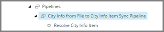

Add Pipeline Step to Apply Mappings
===================================================
The result of the first step in this pipeline is to 
ensure a target object is available, either by finding
an existing item or creating a new one. The next step
involves mapping values from the source object to the
target object, using the value mapping set you 
configured in :doc:`add-value-mappings`.

1. Select the pipeline item **City Info from File to City Info Item Sync Pipeline**.

2. Add the following item:

+---------------------------+---------------------------------------------------------------------+
| Template                  | **Apply Mapping Pipeline Step**                                     |
+---------------------------+---------------------------------------------------------------------+
| Item name                 | **Apply Mapping**                                                   |
+---------------------------+---------------------------------------------------------------------+

3. Select the new item.

4. Set the following field values:

.. |field1-name| replace:: Mapping Set
.. |field1-value| replace:: **Value Mapping Sets > Row from City Information File to City Information Item**

+---------------------------+---------------------------------------------------------------------+
| Field                     | Value                                                               |
+===========================+=====================================================================+
| |field1-name|             | |field1-value|                                                      |
+---------------------------+---------------------------------------------------------------------+

5. Save the item.

6. Make the new item the second step in the pipeline.

