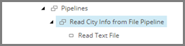

Add Pipeline Step to Iterate Data Read from Source File
============================================================
The result of the first step in this pipeline is to 
add a pointer to a location where subsequent pipeline
steps can access it. The second step in this pipeline
accesses the data so it can iterate the lines read 
from the text file and pass the data from the line 
to the pipeline that handles the data.

1. Select the pipeline item **City Info from File to City Info Item Sync Pipeline**.

2. Add the following item:

+---------------------------+---------------------------------------------------------------------+
| Template                  | **Iterate Data and Run Pipelines Pipeline Step**                    |
+---------------------------+---------------------------------------------------------------------+
| Item name                 | **Iterate Rows from Text File and Run Pipeline**                    |
+---------------------------+---------------------------------------------------------------------+

3. Select the new item.

4. Set the following field values:

.. |field1-name| replace:: Pipelines
.. |field1-value| replace:: **Pipelines > City Info from File to City Info Item Sync Pipeline**
.. |field2-name| replace:: Iterable Data Location
.. |field2-value| replace:: **Pipeline Context Iterable Data**
.. |field3-name| replace:: Data Location
.. |field3-value| replace:: **Pipeline Context Source**

+---------------------------+---------------------------------------------------------------------+
| Field                     | Value                                                               |
+===========================+=====================================================================+
| |field1-name|             | |field1-value|                                                      |
+---------------------------+---------------------------------------------------------------------+
| |field2-name|             | |field2-value|                                                      |
+---------------------------+---------------------------------------------------------------------+
| |field3-name|             | |field3-value|                                                      |
+---------------------------+---------------------------------------------------------------------+

5. Save the item.

6. Make the new item the second step in the pipeline.

