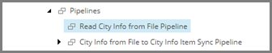

Add Pipeline Step to Read Data from Source File
===================================================
The first pipeline step reads the text file specified
by the text file endpoint. It also puts a pointer to
the data read in a location where the data is 
available to subsequent pipeline steps.

1. Select the pipeline item **Read City Info from File Pipeline**.

2. Add the following item:

+---------------------------+---------------------------------------------------------------------+
| Template                  | **Read Text File Pipeline Step**                                    |
+---------------------------+---------------------------------------------------------------------+
| Item name                 | **Read Text File**                                                  |
+---------------------------+---------------------------------------------------------------------+

4. Select the new item.

5. Set the following field values:

.. |field1-name| replace:: Endpoint From
.. |field1-value| replace:: **File System > City Information File**

+---------------------------+---------------------------------------------------------------------+
| Field                     | Value                                                               |
+===========================+=====================================================================+
| |field1-name|             | |field1-value|                                                      |
+---------------------------+---------------------------------------------------------------------+

6. Save the item.
