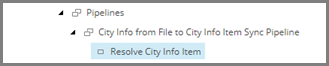

Add Pipeline Step to Resolve Target Item
===================================================
The first pipeline step determines whether a Sitecore 
item already exists. It does this by looking for an 
item at a specific location whose identifier field
matches the value from the row from the text file.

If a matching item is found, that item is set as the
target object in the pipeline context. This means 
that during the mapping process, this is the object
that values will be written to.

If no matching item is found, a new item is created.
The new item is set as the target object in the
pipeline context.

1. Select the pipeline item **City Info from File to City Info Item Sync Pipeline**.

.. image:: _static/pipeline-single-row-no-children.png

2. Add the following item:

+---------------------------+---------------------------------------------------------------------+
| Template                  | **Resolve Sitecore Item Pipeline Step**                             |
+---------------------------+---------------------------------------------------------------------+
| Item name                 | **Resolve City Info Item**                                          |
+---------------------------+---------------------------------------------------------------------+

4. Select the new item.

5. Set the following field values:

.. |field1-name| replace:: Template for New Item
.. |field1-value| replace:: **Templates > User Defined > City Information**
.. |field2-name| replace:: Item Name Value Accessor
.. |field2-value| replace:: **Data Access > Value Accessor Sets > Providers > File System > City Information File Fields > City from City Information File**
.. |field3-name| replace:: Endpoint From
.. |field3-value| replace:: **Sitecore > Sitecore Database Endpoint**
.. |field4-name| replace:: Identifier Value Accessor
.. |field4-value| replace:: **Data Access > Value Accessor Sets > Providers > File System > City Information File Fields > Identifier from City Information File**
.. |field5-name| replace:: Identifier Object Location
.. |field5-value| replace:: **Pipeline Context Source**
.. |field6-name| replace:: Resolved Object Location
.. |field6-value| replace:: **Pipeline Context Target**
.. |field7-name| replace:: Parent for Item
.. |field7-value| replace:: **sitecore > content > Cities**
.. |field8-name| replace:: Matching Field Value Accessor
.. |field8-value| replace:: **Data Access > Value Accessor Sets > Providers > Sitecore > City Information Item Fields > Identifier on City Information Item**

+---------------------------+---------------------------------------------------------------------+
| Field                     | Value                                                               |
+===========================+=====================================================================+
| |field1-name|             | |field1-value|                                                      |
+---------------------------+---------------------------------------------------------------------+
| |field2-name|             | |field2-value|                                                      |
+---------------------------+---------------------------------------------------------------------+
| |field3-name|             | |field3-value|                                                      |
+---------------------------+---------------------------------------------------------------------+
| |field4-name|             | |field4-value|                                                      |
+---------------------------+---------------------------------------------------------------------+
| |field5-name|             | |field5-value|                                                      |
+---------------------------+---------------------------------------------------------------------+
| |field6-name|             | |field6-value|                                                      |
+---------------------------+---------------------------------------------------------------------+
| |field7-name|             | |field7-value|                                                      |
+---------------------------+---------------------------------------------------------------------+
| |field8-name|             | |field8-value|                                                      |
+---------------------------+---------------------------------------------------------------------+

6. Save the item.
