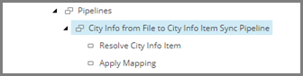
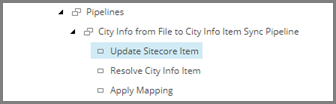
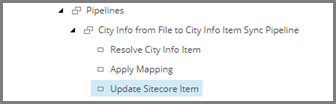

Add Pipeline Step to Update Target Item
===================================================
After mappings are applied, the changes to the target 
item must be saved to the Sitecore database.

1. Select the pipeline item **City Info from File to City Info Item Sync Pipeline**.

2. Add the following item:

+---------------------------+---------------------------------------------------------------------+
| Template                  | **Update Sitecore Item Pipeline Step**                              |
+---------------------------+---------------------------------------------------------------------+
| Item name                 | **Update Sitecore Item**                                            |
+---------------------------+---------------------------------------------------------------------+

3. Select the new item.

4. Set the following field values:

.. |field1-name| replace:: Item Location
.. |field1-value| replace:: **Pipeline Context Target**
.. |field2-name| replace:: Endpoint To
.. |field2-value| replace:: **Sitecore > Sitecore Database Endpoint**

+---------------------------+---------------------------------------------------------------------+
| Field                     | Value                                                               |
+===========================+=====================================================================+
| |field1-name|             | |field1-value|                                                      |
+---------------------------+---------------------------------------------------------------------+
| |field2-name|             | |field2-value|                                                      |
+---------------------------+---------------------------------------------------------------------+

5. Save the item.

6. Make the new item the third step in the pipeline.

