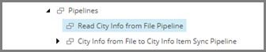

Add Pipeline to Read Source File
===================================================
Next you must implement the pipeline responsible for
reading data from the text file, iterating the data,
and passing the data to the pipeline that handles a
single row of data.

1. In Content Editor, select the tenant.

.. image:: _static/select-new-tenant.png

2. Navigate to **Pipelines**

3. Add the following item:

+---------------------------+---------------------------------------------------------------------+
| Template                  | **Pipeline**                                                        |
+---------------------------+---------------------------------------------------------------------+
| Item name                 | **Read City Info from File Pipeline**                               |
+---------------------------+---------------------------------------------------------------------+

4. Select the new item.

5. Make the new item the first pipeline.

.. note::

    The order of the pipelines is not important. But 
    when a pipeline calls another pipeline, it is helpful 
    to set the pipeline that calls the other pipeline to
    appear before the pipeline it calls.