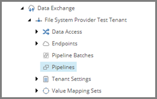

Add Pipeline to Sync Single Row from Source File
===================================================
The synchronization process you are modeling consists 
of two pipelines. The first pipeline reads data from 
a source object, which is a text file. The second 
pipeline handles a single row from the text file.

Since the first pipeline calls the second pipeline, 
you must configure the second pipeline before you 
can configure the first.

1. In Content Editor, select the tenant.

.. image:: _static/select-new-tenant.png

2. Navigate to **Pipelines**

3. Add the following item:

+---------------------------+---------------------------------------------------------------------+
| Template                  | **Pipeline**                                                        |
+---------------------------+---------------------------------------------------------------------+
| Item name                 | **City Info from File to City Info Item Sync Pipeline**             |
+---------------------------+---------------------------------------------------------------------+

4. Select the new item.

