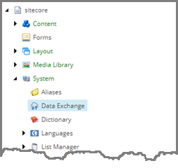
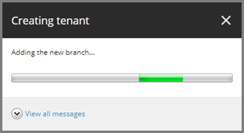
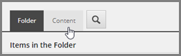

Add Tenant
===================================================
A tenant is the parent item for all of the settings 
related to a set of related data synchronization 
processes. In this example, a tenant is used to 
group the settings needed to read data from a 
text file and to create Sitecore items from 
that data.

1. In Sitecore, open Content Editor.
2. Navigate to **sitecore > system > Data Exchange**.

3. Add the following item:

+---------------------------+---------------------------------------------------------------------+
| Template                  | **Empty Data Exchange Tenant**                                      |
+---------------------------+---------------------------------------------------------------------+
| Item name                 | **File System Provider Test Tenant**                                |
+---------------------------+---------------------------------------------------------------------+

4. A dialog will appear as the tenant is created.

5. Select the tenant.

.. image:: _static/select-new-tenant.png

6. Click the **Content** tab.

7. Set the following field values:

.. |field-value-for-facet-definition| replace:: **Collection Models > Custom Models > Custom Collection Model for Salesforce > Facets > Contact > SalesforceAccount**
.. |field-value-for-mapping-set| replace:: **Value Mapping Sets > Salesforce to xConnect Contact Mappings > Salesforce Contact to xConnect Contact Salesforce Account Information Facet**

+---------------------------+---------------------------------------------------------------------+
| Field                     | Value                                                               |
+===========================+=====================================================================+
| Enabled                   | **ticked**                                                          |
+---------------------------+---------------------------------------------------------------------+

8. Save the item.
