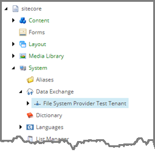
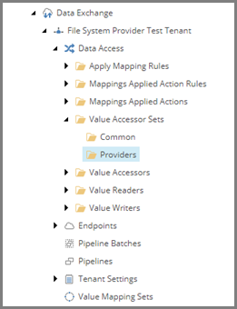
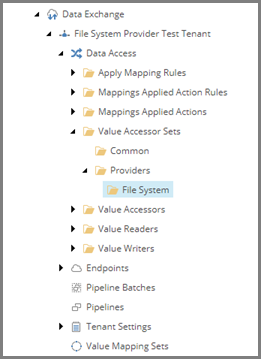
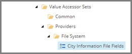
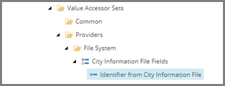
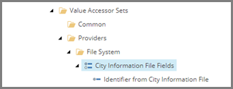
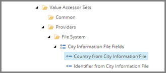
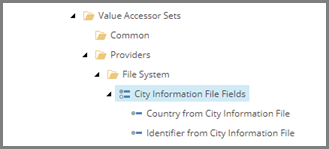
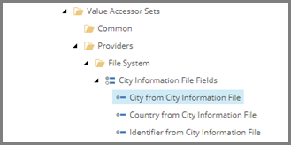

Add Value Accessors for Source File
===================================================
In order to read values from the source file, value accessors
are needed. Related value accessors are grouped into value
accessor sets. A value accessor set may contain one or more
value accessors. 

Each value accessor represents a specific value
from a row in the source file.

.. contents:: In this topic:
   :local:

Create Folder for Value Accessor Set
---------------------------------------------------
Under a tenant, value accessor sets are organized by provider. 
Each provider has its own folder. A folder is needed to hold
the value accessor sets for the new provider.

1. In Content Editor, select the tenant.

2. Navigate to **Data Access > Value Accessor Sets > Providers**

3. Add the following item:

+---------------------------+---------------------------------------------------------------------+
| Template                  | **File System Value Accessor Sets**                                 |
+---------------------------+---------------------------------------------------------------------+

.. hint::

    This template is a command template. It does not prompt 
    for the item name. The command template assigns the item 
    name automatically.

4. Select the new item.

Create Value Accessor Set
---------------------------------------------------
Next, you need to create a value accessor set that represents
all of the values you want to read from a row in the source file.

1. Add the following item:

+---------------------------+---------------------------------------------------------------------+
| Template                  | **Array Value Accessor Set**                                        |
+---------------------------+---------------------------------------------------------------------+
| Item name                 | **City Information File Fields**                                    |
+---------------------------+---------------------------------------------------------------------+

2. Select the new item.

Create Value Accessors
---------------------------------------------------
For each value you want to read from a row in the source file
you need a separate value accessor. When a row is read from 
the source file, it is split into an array. Each value 
accessor represents a position in that array.

1. Add the following item:

+---------------------------+---------------------------------------------------------------------+
| Template                  | **Array Value Accessor**                                            |
+---------------------------+---------------------------------------------------------------------+
| Item name                 | **Identifier from City Information File**                           |
+---------------------------+---------------------------------------------------------------------+

2. Select the new item.

3. Set the following field values:

+---------------------------+---------------------------------------------------------------------+
| Field                     | Value                                                               |
+===========================+=====================================================================+
| Position                  | **0**                                                               |
+---------------------------+---------------------------------------------------------------------+

4. Save the item.

5. Select the item **City Information File Fields**.

6. Add the following item:

+---------------------------+---------------------------------------------------------------------+
| Template                  | **Array Value Accessor**                                            |
+---------------------------+---------------------------------------------------------------------+
| Item name                 | **Country from City Information File**                              |
+---------------------------+---------------------------------------------------------------------+

7. Select the new item.

8. Set the following field values:

+---------------------------+---------------------------------------------------------------------+
| Field                     | Value                                                               |
+===========================+=====================================================================+
| Position                  | **1**                                                               |
+---------------------------+---------------------------------------------------------------------+

9. Save the item.

10. Select the item **City Information File Fields**.

11. Add the following item:

+---------------------------+---------------------------------------------------------------------+
| Template                  | **Array Value Accessor**                                            |
+---------------------------+---------------------------------------------------------------------+
| Item name                 | **City from City Information File**                                 |
+---------------------------+---------------------------------------------------------------------+

12. Select the new item.

13. Set the following field values:

+---------------------------+---------------------------------------------------------------------+
| Field                     | Value                                                               |
+===========================+=====================================================================+
| Position                  | **2**                                                               |
+---------------------------+---------------------------------------------------------------------+

14. Save the item.

