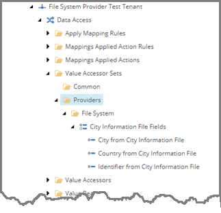
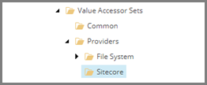
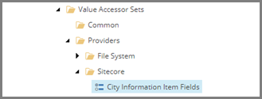
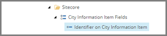
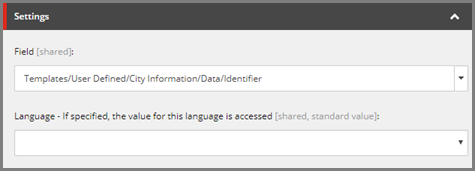
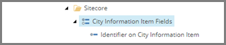
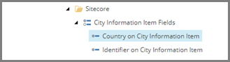
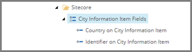
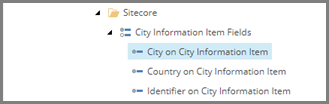

Add Value Accessors for Target Items
===================================================
In order to write values to the Sitecore items (target items)
that act as the target objects, value accessors are needed. 
Each value accessor represents a specific field on the 
template used for the target items.

.. contents:: In this topic:
   :local:

Create Folder for Value Accessor Set
---------------------------------------------------
Under a tenant, value accessor sets are organized by provider. 
Each provider has its own folder. A folder is needed to hold
the value accessor sets for the new provider.

1. In Content Editor, select the tenant.

.. image:: _static/select-new-tenant.png

2. Navigate to **Data Access > Value Accessor Sets > Providers**

3. Add the following item:

+---------------------------+---------------------------------------------------------------------+
| Template                  | **Sitecore Value Accessor Sets**                                    |
+---------------------------+---------------------------------------------------------------------+

.. hint::

    This template is a command template. It does not prompt 
    for the item name. The command template assigns the item 
    name automatically.

4. Select the new item.

Create Value Accessor Set
---------------------------------------------------
Next, you need to create a value accessor set that represents
all of the fields you want to write to on the target items.

1. Add the following item:

+---------------------------+---------------------------------------------------------------------+
| Template                  | **Sitecore Item Field Value Accessor Set**                          |
+---------------------------+---------------------------------------------------------------------+
| Item name                 | **City Information Item Fields**                                    |
+---------------------------+---------------------------------------------------------------------+

2. Select the new item.

Create Value Accessors
---------------------------------------------------
For each value you want to write to a target item, you 
need a separate value accessor. Each value accessor 
represents a field on the target item.

1. Add the following item:

+---------------------------+---------------------------------------------------------------------+
| Template                  | **Sitecore Item Field Value Accessor**                              |
+---------------------------+---------------------------------------------------------------------+
| Item name                 | **Identifier on City Information Item**                             |
+---------------------------+---------------------------------------------------------------------+

2. Select the new item.

3. Set the following field values:

+---------------------------+---------------------------------------------------------------------+
| Field                     | Value                                                               |
+===========================+=====================================================================+
| Field                     | **Templates > User Defined > City Information > Data > Identifier** |
+---------------------------+---------------------------------------------------------------------+

4. Save the item.

5. Select the item **City Information Item Fields**.

6. Add the following item:

+---------------------------+---------------------------------------------------------------------+
| Template                  | **Sitecore Item Field Value Accessor**                              |
+---------------------------+---------------------------------------------------------------------+
| Item name                 | **Country on City Information Item**                                |
+---------------------------+---------------------------------------------------------------------+

7. Select the new item.

8. Set the following field values:

+---------------------------+---------------------------------------------------------------------+
| Field                     | Value                                                               |
+===========================+=====================================================================+
| Field                     | **Templates > User Defined > City Information > Data > Country**    |
+---------------------------+---------------------------------------------------------------------+

9. Save the item.

10. Select the item **City Information File Fields**.

11. Add the following item:

+---------------------------+---------------------------------------------------------------------+
| Template                  | **Sitecore Item Field Value Accessor**                              |
+---------------------------+---------------------------------------------------------------------+
| Item name                 | **City on City Information Item**                                   |
+---------------------------+---------------------------------------------------------------------+

12. Select the new item.

13. Set the following field values:

+---------------------------+---------------------------------------------------------------------+
| Field                     | Value                                                               |
+===========================+=====================================================================+
| Field                     | **Templates > User Defined > City Information > Data > City**       |
+---------------------------+---------------------------------------------------------------------+

14. Save the item.

