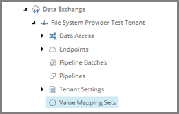
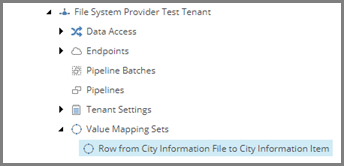
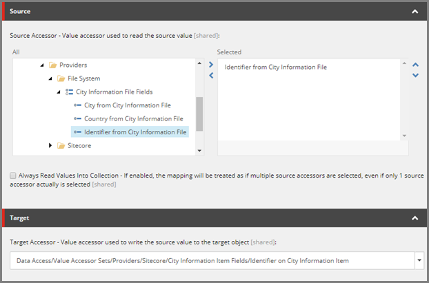
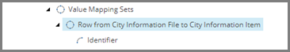
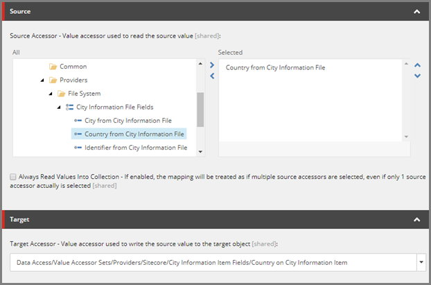
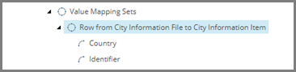
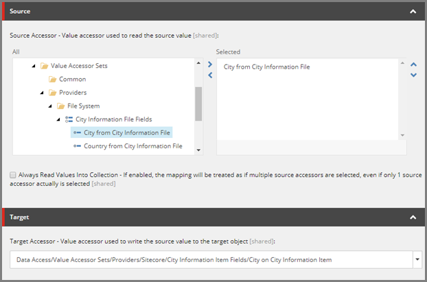

Add Value Mappings
===================================================
Value mappings are used to associate a value accessor
for a source object with a value accessor for a target
object. In this example, value mappings associate the
value accessors used to read values from the text file
with the value accessors used to write values to the 
corresponding Sitecore item.

.. contents:: In this topic:
   :local:

Create Value Mapping Set
---------------------------------------------------
Just like related value accessors (such as all the 
value accessors used to read values from a specific 
type of text file) are grouped together under a value
accessor set, related value mappings are grouped 
together under a value mapping set. 

In this example, a value mapping set represents all
of the values that are mapped from a row in a text
file to a Sitecore item.

1. In Content Editor, select the tenant.

.. image:: _static/select-new-tenant.png

2. Navigate to **Value Mapping Sets**

3. Add the following item:

+---------------------------+---------------------------------------------------------------------+
| Template                  | **Value Mapping Set**                                               |
+---------------------------+---------------------------------------------------------------------+
| Item name                 | **Row from City Information File to City Information Item**         |
+---------------------------+---------------------------------------------------------------------+

Create Value Mapping for Identifier
---------------------------------------------------

1. Select the new item.

2. Add the following item:

+---------------------------+---------------------------------------------------------------------+
| Template                  | **Value Mapping**                                                   |
+---------------------------+---------------------------------------------------------------------+
| Item name                 | **Identifier**                                                      |
+---------------------------+---------------------------------------------------------------------+

3. Select the new item.

4. Set the following field values:

.. |identifier-source-accessor| replace:: **Data Access > Value Accessor Sets > Providers > File System > City Information File Fields > Identifier from City Information File**
.. |identifier-target-accessor| replace:: **Data Access > Value Accessor Sets > Providers > Sitecore > City Information Item Fields > Identifier on City Information Item**

+---------------------------+---------------------------------------------------------------------+
| Field                     | Value                                                               |
+===========================+=====================================================================+
| Source Accessor           | |identifier-source-accessor|                                        |
+---------------------------+---------------------------------------------------------------------+
| Target Accessor           | |identifier-target-accessor|                                        |
+---------------------------+---------------------------------------------------------------------+

5. Save the item.

Create Value Mapping for Country
---------------------------------------------------

1. Select the item **Row from City Information File to City Information Item**.

2. Add the following item:

+---------------------------+---------------------------------------------------------------------+
| Template                  | **Value Mapping**                                                   |
+---------------------------+---------------------------------------------------------------------+
| Item name                 | **Country**                                                         |
+---------------------------+---------------------------------------------------------------------+

3. Select the new item.

4. Set the following field values:

.. |country-source-accessor| replace:: **Data Access > Value Accessor Sets > Providers > File System > City Information File Fields > Country from City Information File**
.. |country-target-accessor| replace:: **Data Access > Value Accessor Sets > Providers > Sitecore > City Information Item Fields > Country on City Information Item**

+---------------------------+---------------------------------------------------------------------+
| Field                     | Value                                                               |
+===========================+=====================================================================+
| Source Accessor           | |country-source-accessor|                                           |
+---------------------------+---------------------------------------------------------------------+
| Target Accessor           | |country-target-accessor|                                           |
+---------------------------+---------------------------------------------------------------------+

5. Save the item.

Create Value Mapping for City
---------------------------------------------------

1. Select the item **Row from City Information File to City Information Item**.

2. Add the following item:

+---------------------------+---------------------------------------------------------------------+
| Template                  | **Value Mapping**                                                   |
+---------------------------+---------------------------------------------------------------------+
| Item name                 | **City**                                                            |
+---------------------------+---------------------------------------------------------------------+

3. Select the new item.

4. Set the following field values:

.. |city-source-accessor| replace:: **Data Access > Value Accessor Sets > Providers > File System > City Information File Fields > City from City Information File**
.. |city-target-accessor| replace:: **Data Access > Value Accessor Sets > Providers > Sitecore > City Information Item Fields > City on City Information Item**

+---------------------------+---------------------------------------------------------------------+
| Field                     | Value                                                               |
+===========================+=====================================================================+
| Source Accessor           | |city-source-accessor|                                              |
+---------------------------+---------------------------------------------------------------------+
| Target Accessor           | |city-target-accessor|                                              |
+---------------------------+---------------------------------------------------------------------+

5. Save the item.

