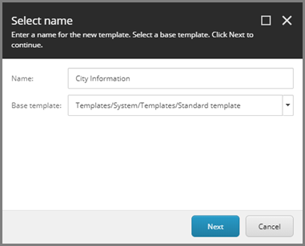
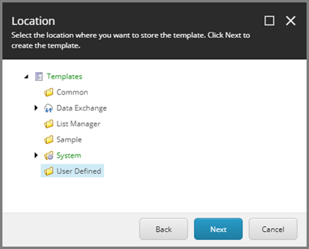
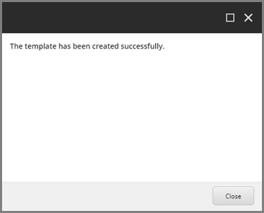
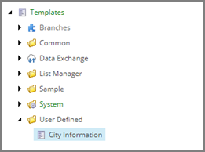
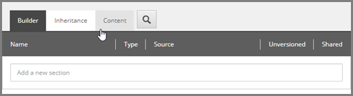
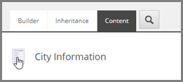
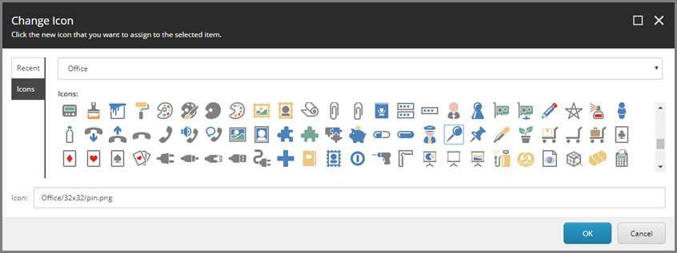
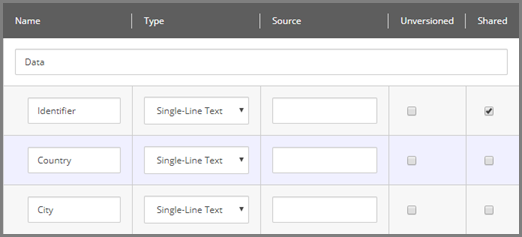

Create Template for Target Items
===================================================
In this example, each row from a text file represents
information about a city. The data synchronization 
process will map the data from the text file to a 
Sitecore item. A Sitecore template is needed to
store this information.

.. contents:: In this topic:
   :local:

Create Template
---------------------------------------------------
1. In Sitecore, open Template Manager.
2. Add a new template.

.. image:: _static/add-template.png

3. Click **Next**.

4. Select **Templates > User Defined**.

5. Click **Next**.
6. Click **Close**.

Set Icon
---------------------------------------------------
1. Select the new template.

2. Click the **Content** tab.

3. Click the icon.

4. Enter ``Office/32x32/pin.png``

5. Click **OK**.

Add Fields
---------------------------------------------------
1. Add a template section named **Data**.
2. Add the following field:

+---------------------------+---------------------------------------------------------------------+
| Name                      | **Identifier**                                                      |
+---------------------------+---------------------------------------------------------------------+
| Type                      | **Single-Line Text**                                                |
+---------------------------+---------------------------------------------------------------------+
| Shared                    | **ticked**                                                          |
+---------------------------+---------------------------------------------------------------------+

3. Add the following field:

+---------------------------+---------------------------------------------------------------------+
| Name                      | **Country**                                                         |
+---------------------------+---------------------------------------------------------------------+
| Type                      | **Single-Line Text**                                                |
+---------------------------+---------------------------------------------------------------------+

4. Add the following field:

+---------------------------+---------------------------------------------------------------------+
| Name                      | **City**                                                            |
+---------------------------+---------------------------------------------------------------------+
| Type                      | **Single-Line Text**                                                |
+---------------------------+---------------------------------------------------------------------+

5. Save the item.

