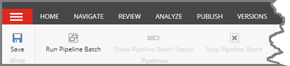
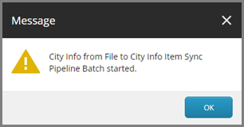
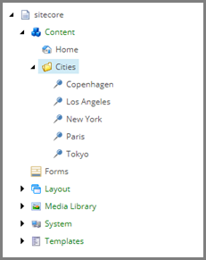
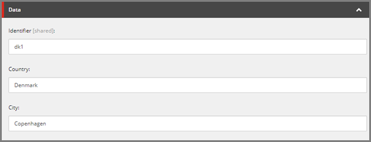

Test Pipeline Batch
===================================================
A pipeline batch can be run in a number of ways.
The easiest is to run it manually.

1. In Content Editor, select the tenant.

.. image:: _static/select-new-tenant.png

2. Navigate to **Pipeline Batches > City Info from File to City Info Item Sync Pipeline Batch**

3. In the ribbon, click **Run Pipeline Batch**.

4. Click **OK**.

.. note::

    In this example, the text file only contains a few rows.
    In addition, the logic in the pipelines is very limited.
    This means the pipeline batch will finish almost instantly.

    You can tell if the pipeline batch is running by checking
    if the button **Stop Pipeline Batch** is enabled. This 
    button will not automatically refresh, so you may need 
    to click the pipeline batch in order for the UI to 
    refresh.

5. Navigate to **sitecore > content > Cities**

.. note::

    You should see an item for each of the rows in the text files.

6. Select **Copenhagen**.

.. note::

    You should see the values from the row in the text 
    file that corresponds to Copenhagen.