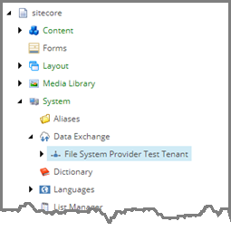
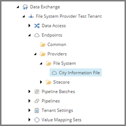
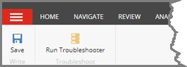
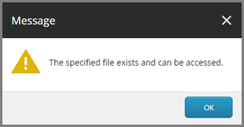
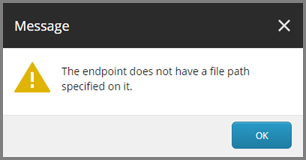
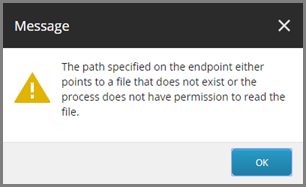

Test Troubleshooter
===================================================
The troubleshooter was assigned to the text file endpoint,
so testing the troubleshooter means selecting the endpoint.

1. In Content Editor, select the tenant.

2. Navigate to **Endpoints > Providers > File System > City Information File**

3. In the ribbon, click **Run Troubleshooter**.

If the endpoint is configured properly, 
the file exists and the Sitecore server 
can access the file, the success message 
is displayed.

If the endpoint does not have a file path
specified, an error message is displayed.

If the endpoint has a file path specified, 
but the file does not exist, or file permissions
prevent the Sitecore server from accessing the 
file, an error message is displayed.

