Create Template For Custom Value Mapping Set
===================================================
In order to be able to configure the data synchronization
process to use custom *value mapping set*, a template is
needed.

.. contents:: In this topic:
   :local:

Create Template
---------------------------------------------------
1. In Sitecore, open Template Manager.
2. Add a new template.

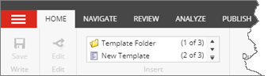

3. Enter the following values:

.. |base-template| replace:: **Templates > Data Exchange > Framework > Data Access > Mapping > Value Mapping Set**

+---------------------------+---------------------------------------------------------------------+
| Name                      | **Custom Value Mapping Set**                                        |
+---------------------------+---------------------------------------------------------------------+
| Base template             | |base-template|                                                     |
+---------------------------+---------------------------------------------------------------------+

4. Click **Next**.

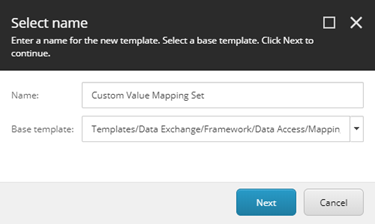

5. Select **Templates > Data Exchange > Framework > Data Access > Mapping**.

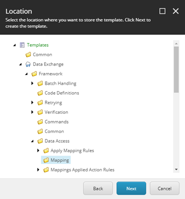

6. Click **Next**.
7. Click **Close**.

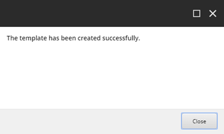

Set Icon
---------------------------------------------------
1. Select the new template.

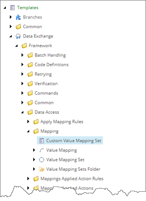

2. Click the **Content** tab.

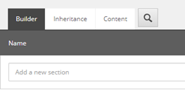

3. Click the icon.

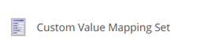

4. Enter ``Office/32x32/vector_circle.png``

.. image:: _static/change-icon.png

5. Click **OK**.

Add Standard Values
---------------------------------------------------
1. Click the **Builder** tab.

.. image:: _static/new-template-selected-new-icon.png

2. In the ribbon, click **Builder OPTIONS**.

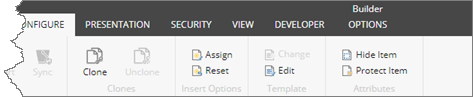

3. Click **Standard values**.

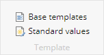

4. Select the new item.

.. image:: _static/standard-values-item-selected.png

Remove Insert Option For Value Mapping
---------------------------------------------------
Since all of your value mapping is done in code, there
is no reason to allow users to add *value mapping* items
under the custom value mapping set.

1. In the ribbon, click **CONFIGURE**.

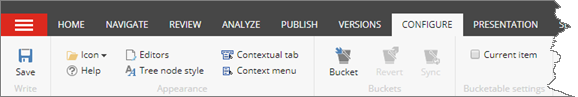

2. Click **Assign**.

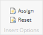

3. In the list on the right, select **Value Mapping**.

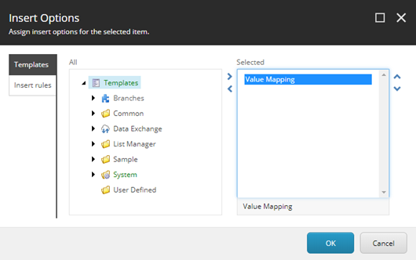

6. Click the left arrow.

7. Click OK.

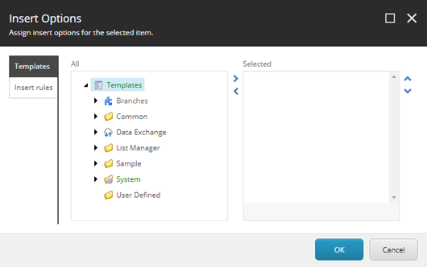
