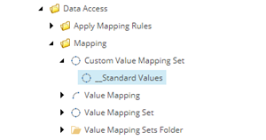

Implement Converter For Custom Value Mapping Set
===================================================
In Data Exchange Framework, Sitecore items are only
used for configuration. When a data synchronization
process runs, the configuration is read from the 
Sitecore items and then converted into framework
components.

.. contents:: In this topic:
   :local:

Get Template Item Id
---------------------------------------------------
1. In Sitecore, open Template Manager.
2. Navigate to **sitecore > templates > Data Exchange > Framework > Data Access > Mapping > Custom Value Mapping Set**

3. Click the **Content** tab.

4. In the Quick Info section, copy the **Item ID** value.

Implement Class
---------------------------------------------------
A custom converter is needed to transform the Sitecore
item that represents the custom *value mapping set*
into an instance of your custom *value mapping set* 
type.

1. In Visual Studio, add the following class:

.. code-block:: c#

    using Sitecore.DataExchange;
    using Sitecore.DataExchange.Attributes;
    using Sitecore.DataExchange.Converters;
    using Sitecore.DataExchange.Repositories;
    using Sitecore.Services.Core.Model;
    using System;
    using System.Collections.Generic;
    using System.Linq;
    using System.Text;
    using System.Threading.Tasks;

    namespace Examples.DataExchange
    {
        [SupportedIds("{73E9A7D8-33A0-4D28-8A97-1A49C7CFD3ED}")]
        public class CustomMappingSetConverter : BaseItemModelConverter<CustomMappingSet>
        {
            public CustomMappingSetConverter(IItemModelRepository repository) : base(repository)
            {
            }
            private static CustomMappingSet _instance = new CustomMappingSet();
            protected override ConvertResult<CustomMappingSet> ConvertSupportedItem(ItemModel source)
            {
                return ConvertResult<CustomMappingSet>.PositiveResult(_instance);
            }
        }
    }

.. note::

    Be sure to use the template item id from the previous step in the attribute ``SupportedIds``.

Set Converter Type On Template
---------------------------------------------------
1. In Sitecore, open Template Manager.
2. Navigate to **sitecore > templates > Data Exchange > Framework > Data Access > Mapping > Custom Value Mapping Set > __Standard Values**

3. Set the following field values:

.. |converter-type| replace:: ``Examples.DataExchange.CustomMappingSetConverter, Examples.DataExchange``

+---------------------------+---------------------------------------------------------------------+
| Field                     | Value                                                               |
+===========================+=====================================================================+
| Converter Type            | |converter-type|                                                    |
+---------------------------+---------------------------------------------------------------------+

4. Save the item.
