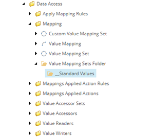
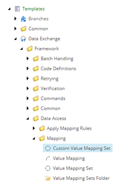
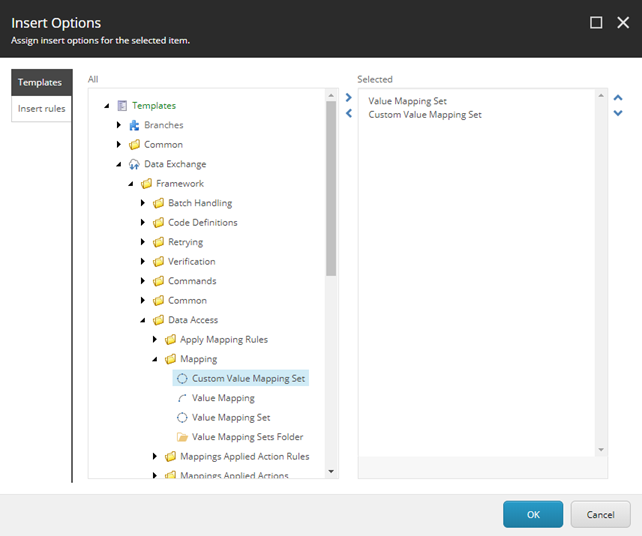

Integrate Custom Value Mapping Set
===================================================
The final step is to integrate your custom *value mapping set*
into Data Exchange Framework.

.. contents:: In this topic:
   :local:

Deploy Custom Components
---------------------------------------------------
1. Build the Visual Studio project.
2. Copy **Examples.DataExchange.dll** to your Sitecore server.

Set Insert Options For Value Mapping Sets Folder
---------------------------------------------------
1. In Sitecore, open Template Manager.
2. Navigate to **sitecore > templates > Data Exchange > Framework > Data Access > Mapping > Value Mapping Sets Folder > __Standard Values**

3. In the ribbon, click **CONFIGURE**.

.. image:: _static/configure-tab.png

4. Click **Assign**.

.. image:: _static/insert-options-button.png

5. In the tree on the left, navigate to **Templates > Data Exchange > Framework > Data Access > Mapping > Custom Value Mapping Set**

6. Click the right arrow.

.. image:: _static/right-arrow.png

7. Click OK.

Use Custom Value Mapping Set
---------------------------------------------------
When configuring your data synchronization process,
you should use your custom *value mapping set*:

    * For new tenants you create, you should use your custom *value mapping set*. 
    * For tenants that already exist, you should replace the *value mapping set* currently used with your custom *value mapping set*.
